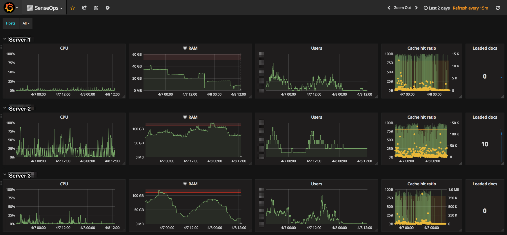
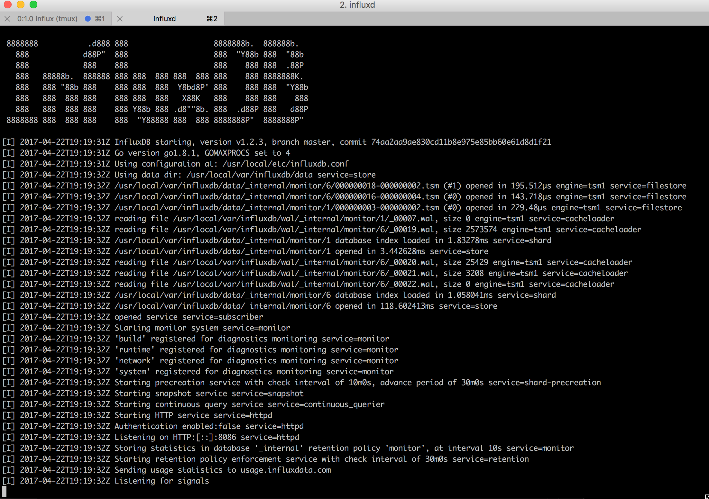

  

  
# Butler SOS
Butler SenseOps Stats ("Butler SOS") is a Node.js service publishing operational Qlik Sense Enterprise metrics to MQTT and Influxdb.  
It uses the [Sense healthcheck API](http://help.qlik.com/en-US/sense-developer/3.2/Subsystems/EngineAPI/Content/GettingSystemInformation/HealthCheckStatus.htm) to gather operational metrics for the Sense servers specified in the JSON config file.

The most interesting use of Butler SOS is probably to create real-time dashboards, showing operational metrics for a Qlik Sense Enterprise environment:

Butler SOS can however also send the data to [MQTT](https://en.wikipedia.org/wiki/MQTT), for use in any MQTT capable tool or system.

## Install and setup
* Clone [the repository](https://github.com/mountaindude/butler-sos) from GitHub to desired location.  
* Make sure [Node.js](https://nodejs.org) is installed. Butler-SOS has been tested with Node.js 6.10.0. 
* Run "npm install" from within the main butler-sos directory to download and install all Node.js dependencies.
* Make a copy of the [config/default_template.json](https://github.com/mountaindude/butler-sos/blob/master/config/default_template.json) configuration file. Edit the file as needed, save it as "default.json" in the ./config directory.
Butler SOS will read its config settings from the default.json file.
* Install [Influxdb](https://docs.influxdata.com/influxdb/v1.2/introduction) (only needed if data is to be stored in Influxdb, of course).
* Install [Mosquitto](https://mosquitto.org) or another MQTT broker (only needed if data is to be forwarded to MQTT).

### Virtual proxies
Butler SOS relies on a [Qlik Sense virtual proxy](http://help.qlik.com/en-US/sense/3.2/Subsystems/ManagementConsole/Content/create-virtual-proxy.htm) to be available for each Sense server that is to be monitored.  
Existing virtual proxies or new ones can be used - just make sure authentication etc work, and that the host name in the config file points to the correct virtual proxy of each server.
  
For example, let's say the config/default.json config file contains 

    "serversToMonitor": {
        "servers": [{
                "host": "server1.my.domain/virtualproxyname",
                "serverName": "Server 1",
                "availableRAM": 32000
            }]

Butler SOS will then query https://server1.my.domain/virtualproxyname/engine/healthcheck to get operational metrics for the Qlik Sense engine on server1.my.domain.
Make sure that the "virtualproxyname" virtual proxy has authentication suitable to your Qlik Sense setup.

Future versions of Butler SOS may not need these virtual proxies - maybe the needed data can be retrieved straight from the engine. Further work needed to make this happen though.

## Usage
Start Influxdb and Mosquitto (or other MQTT broker).   
Both Influxdb and Mosquitto should work right after installation - for production use their respective config files should of course be edited as needed, to ensure they work as desired.

Starting Influxdb on OSX will look something like this:

Then start Butler SOS itself from the main butler-sos directory:  
"node butler-sos.js".  
  
If the Influxdb database specified in the config file does not exist, it will be created:

Here we see how three servers are queried for data.  
The responses are retrived asyncronously as they arrive from the different servers.  
Finally, the data is stored to Influxdb and sent as MQTT messages.

### Installation cheat sheet
By popular request, here are the commands needed to install Influx and Grafana.  
The commands below assume you are using a Mac and have the [Homebrew](https://brew.sh/) package manager installed.  
You can also install the software on a Linux server (apt-get install ... on Debian etc). Windows might be possible, but it is usually easier to spin up a small Linux server in a Docker container on your Windows PC, compared to installing the actual software on Windows...   
Using Docker containers is actually a great way to play around with software, without clogging down your own computer. 
  
Install and start Influx:  

    brew install influxdb
    influxd -config /usr/local/etc/influxdb.conf

Install and start Grafana

    brew install grafana
    brew services start grafana

Connect to Grafana by visiting http://localhost:3000  
Default username/pwd is admin/admin.

## Real-time dashboards using Grafana
Once the data exists in Influxdb it can be visualised using [Grafana](https://grafana.com).
  
A sample dashboard is included in the Grafana directory - it should work out of the box when imported into your Grafana environment.  
Grafana is extremely powerful. Creating automatically updating dashboards for any number of servers is a matter of a few minutes work. Tutorials and docs can be found on their site.

## References
  
Please see [https://ptarmiganlabs.com](https://ptarmiganlabs.com/blog/2017/04/24/butler-sos-real-time-server-stats-qlik-sense/) and [https://github.com/mountaindude/butler](https://github.com/mountaindude/butler) for more in-depth info on the Butler family of micro services.
  
At [https://senseops.rocks](https://senseops.rocks) you also find thoughts on using DevOps best practices in the Qlik Sense ecosystem.
