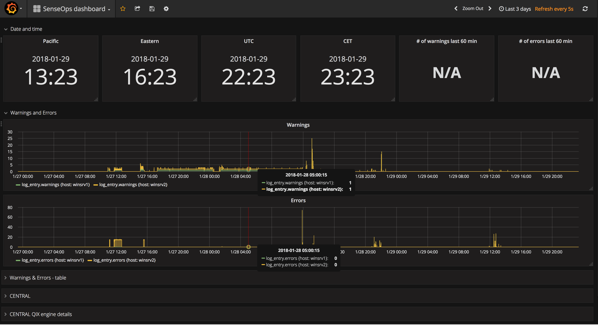
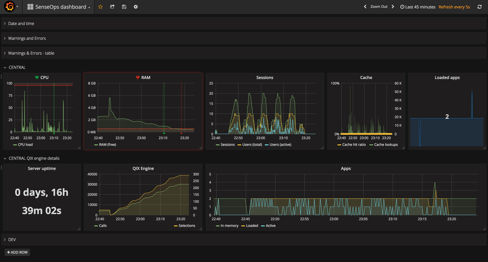
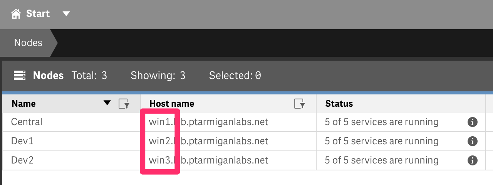
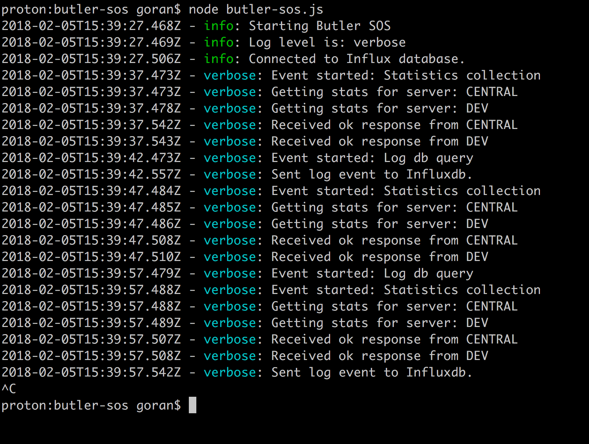

# Butler SOS

[](https://travis-ci.com/ptarmiganlabs/butler-sos)

  

Butler SenseOps Stats ("Butler SOS") is a DevOps monitoring tool for [Qlik Sense](https://www.qlik.com/us/products/qlik-sense).  
It publishes operational Qlik Sense Enterprise metrics to [MQTT](https://en.wikipedia.org/wiki/MQTT) and [InfluxDB](https://www.influxdata.com/time-series-platform/influxdb/), from where it can be charted using tools like Grafana or acted on by downstream systems that listen to the MQTT topics used by Butler SOS.

Butler SOS uses the [Sense healthcheck API](http://help.qlik.com/en-US/sense-developer/November2017/Subsystems/EngineAPI/Content/GettingSystemInformation/HealthCheckStatus.htm) to gather operational metrics for the Sense servers specified in the YAML config file.  
It also pulls log events from [Sense's Postgres logging database](http://help.qlik.com/en-US/sense/November2017/Subsystems/PlanningQlikSenseDeployments/Content/Deployment/Qlik-Logging-Service.htm), and forwards these to Influx and MQTT.

**Why a separate tool for this?**  
Good question. While Qlik Sense ships with a great Operations Monitor application, it is not useful or intended for real-time operational monitoring.  
It is great for retrospective analysis of what happened in a Qlik Sense environment, but for a real-time understanding of what's going on in a Sense environment something else is needed - enter Butler SOS.

The most interesting use of Butler SOS is probably to create real-time dashboards based on the data in the Influx database, showing operational metrics for a Qlik Sense Enterprise environment.  
A fully interactive demo dashboard is available [here](https://snapshot.raintank.io/dashboard/snapshot/1hNwAmi50lykKYXr6mswhKmll9myrH20?orgId=2).  
  
Sample screen shots:





As mentioned above, Butler SOS can also send data to [MQTT](https://en.wikipedia.org/wiki/MQTT), for use in any MQTT enabled tool or system.

## What's new

Please see the [change log](https://github.com/ptarmiganlabs/butler-sos/blob/master/changelog.md) for a comprehensive list of changes.

Highlights in the most recent release are

### v4.0

Butler SOS is going through very active development, with significant new features added.  
Once again, the format of the both the config file and the Influxdb schema has changed, which means that the SenseOps database in Influxdb has to be recreated.

The upside is that version 4.0 adds several features that make Butler SOS easier to use in large Qlik Sense Enterprise environments with separated development, QA/acceptance, and production environments.

Due to several new settings in the config file, it is recommended to completely review and update the file before deploying v4.0.

* Added optional logging to disk file. If enabled, log files are rotated daily and stored for 30 days, after which they are automatically deleted.
* Improved tagging of data logged in Influxdb. Data can now be tagged with any number of user defined tags. This makes it possible to create much more refined dashboards in Grafana.
NOTE: these configurable tags are not compatible with previous Influx database schemas. The SenseOps database in Influxdb must be deleted before deploying Butler SOS v3.2. Next time Butler SOS is started a new SenseOps database in Influxdb will be created.
* Let the user control (by means of properties in the config file) which entries are extracted from Qlik Sense log db. This is configured on a per log level basis, for example "extract warning and errors, but not info messages".

## Install and setup

* Butler SOS has been tested with Qlik Sense Enterprise up until and including February 2019. Butler SOS uses core Sense APIs that are unlikely to change in future Sense versions. For that reasons Butler SOS is likely to work also with future Sense versions.

### Upgrading to v4

Version 4.0 introduces a slightly different schema for the InfluxDB database.  
While it certainly is possible to migrate existing data, that will not be covered here. Let's instead drop the old InfluxDB database and start over with an empty one.

The steps to achieve this differ slightly depending on how you run Butler SOS. Conceptually they are:

*Running Butler SOS as a native Node.js app:*

* Stop Butler SOS if it is running
* From command line, run `influxdb -host <localhost or IP of InfluxDB server>`
* `show databases` to list InfluxDB databases on your Influxdb server
* `use SenseOps` within influx to select the Butler SOS database
* `drop database SenseOps` to delete the existing database. **WARNING! THERE IS NO WAY OF UN-DOING THIS!**
* `exit` will close the influx client
* Next time Butler SOS is started, an empty Influx database with the correct schema will be created

*Running Butler SOS as a Docker container:*

* From command line, connect to the Docker container: `docker exec -it <container-name> /bin/bash`. <container-name> is the name given in the `docker-compose.yml` file, usually butler-sos.
* From within the container, run `influxdb`.
* Follow the same steps as above ("use SenseOps", "drop database SenseOps", "exit"
* Exit the container by running `exit`

### Configuration file properties

Make a copy of ```./config/default-template.yaml```, rename the new file production.yaml. Edit as needed to match your Qlik Sense Enterprise environment.

The parameters in the config file are described below.
All parameters must be defined in the config file - run time errors will occur otherwise.

| Parameter | Description |
| --------- | ----------- |
| **Butler-SOS** |  |
| logLevel | The level of details in the logs. Possible values are silly, debug, verbose, info, warn, error (in order of decreasing level of detail). |
| fileLogging | true/false to enable/disable logging to disk file |
| logDirectory | Subdirectory where log files are stored |
|  |  |
| **Butler-SOS.logdb** |  |
| enableLogDb | Should Sense log db be queried for warnings/errors/info messages? true/false |
| pollingInterval | How often to query log db. Milliseconds |
| queryPeriod | How far back should log db be queried? Human readable, e.g. "5 minutes"|
| host | IP or FQDN of server where Sense log db is running |
| port | Port used by log db. 4432 unless changed during installation of Sense |
| qlogsReaderUser | User to connect to log db as. "qlogs_reader" unless changed during installation of Sense |
| qlogsReaderPwd | Password of above user |
| extractErrors | Should error entries be extracted from log db? true/false |
| extractWarnings | Should warning entries be extracted from log db? true/false |
| extractInfo | Should info entries be extracted from log db? true/false |
|  |  |
| **Butler-SOS.cert** |  |
| clientCert | Certificate file. Exported from QMC |
| clientCertKey | Certificate key file. Exported from QMC |
| clientCertCA | Root certificate for above certificate files. Exported from QMC |
|  |  |
| **Butler-SOS.mqttConfig** |  |
| enableMQTT | Should health metrics be sent to MQTT? true/false |
| brokerHost | IP or FQDN of MQTT broker |
| brokerPort | Broker port |
| baseTopic | The topic to which messages will be posted. Should end with /. For example butler-sos/ |
|  |  |
| **Butler-SOS.influxdbConfig** |  |
| enableInfluxdb | Should health metrics be stored in Influxdb? true/false |
| hostIP | IP or FQDN of Influxdb server |
| dbName | Database namne in Influxdb to which health metrics will be stored. Database will be created if it does not already exist when Butler SOS is started |
| activeDocs | Should a list of currently active Sense apps be stored in Influxdb? true/false |
| loadedDocs | Should a list of Sense apps opened in a user session be stored in Influxdb? true/false |
| activeDocs | Should a list of Sense apps loaded into memory (some apps might not currently be associated with a user session) be stored in Influxdb? true/false |
|  |  |
| **Butler-SOS.serversToMonitor** |  |
| pollingInterval | How often to query the Sense healthcheck API |
| serverTagsDefinition | List of tags to add to each server when storing the data in Influxdb. All tags defined here MUST be present in each server's definition section further down in the config file! |
| servers | List of what servers to monitor. For each server a set of properties MUST be defined. |
| host | FQDN of server. Domain should match that of the certificate exported from QMC - otherwise certificate warnings may appear |
| serverName | Human friendly server name |
| serverDescription | Human friendly server description |
| logDbHost | Server's name as it appears in the ```process_host``` field log db. This is needed in order to link entries in logdb to the specific server at hand. See note below too! |
| serverTags | A list of key-value pairs. Use to provide more metadata for servers. Can then (among other things) be used to created more advanced Grafana dashboards. |

The ```logDbHost``` property is not entirely easy to understand. Easiest way to get it right is to look in the Nodes section in the QMC. In the ```Host name``` column you find the host names of the various nodes. ```logDbHost``` should be set to the first part of each host name:



### Running as a native Node.js app

* Get the desired Butler SOS version from the [releases page](https://github.com/ptarmiganlabs/butler-sos/releases).
  ***NOTE***: You should not just get the latest source code from the master branch. The master branch might very well be in active development and not do what you expect it to do... The releases have been tested - those are your best bet.
* Make sure [Node.js](https://nodejs.org) is installed. Butler-SOS has been tested with Node.js 10.15.0.
* Run "npm install" from within the main butler-sos directory to download and install all Node.js dependencies.
* Make a copy of the [config/default_template.yaml](https://github.com/ptarmiganlabs/butler-sos/blob/master/config/default_template.yaml) configuration file. Edit the file as needed, save it as "production.yaml" in the ./config directory. Butler SOS will read its config settings from this file.
* [Export certificates](http://help.qlik.com/en-US/sense/November2017/Subsystems/ManagementConsole/Content/export-certificates.htm) from Qlik Sense QMC, then place them in the ./config/certificate folder under Butler SOS' main folder.
* Install [InfluxDB](https://docs.influxdata.com/influxdb/v1.4/introduction) (only needed if data is to be stored in Influxdb).
* Install [Mosquitto](https://mosquitto.org) or another MQTT broker (only needed if data is to be forwarded to MQTT). If you already have an MQTT broker you do not need to install a new one, Butler SOS can use the existing one.

The `production.yaml` file can be named anything, as long as it matches the value of the `NODE_ENV` environment variable.  
For example, if the config file is called `production.yaml`, the NODE_ENV environment variable should be set to 'production':

Windows: `set NODE_ENV=production`  
Linux: `export NODE_ENV=production`

#### Configuration files

Butler SOS calls the main Qlik Sense Engine service (QSE) n TCP port 4747 on each server that is to be monitored. This means that no virtual proxies are used, instead certificates are used to authenticate with Qlik Sense. This provides more flexibility and better security compared to getting the health data via virtual proxies.

Please note that the path to these certificates must be properly configured in the config file's Butler-SOS.cert section.  

When using certificates to authenticate with the Qlik engine, the ```servers``` section of the config file could look like this (note the :4747 after the host name!):

``` yaml
    # Sense Servers that should be queried for healthcheck data
    servers:
    - host: server1.company.net:4747
      serverName: Server1
      serverDescription: Central node
      logDbHost: server1
      serverTags:
        server_group: DEV
        serverLocation: Europe
        server-type: virtual
        serverBrand: HP
    - host: server2.company.net:4747
      serverName: Server1
      serverDescription: Dev server 1
      logDbHost: server1
      serverTags:
        server_group: DEV
        serverLocation: Europe
        server-type: physical
        serverBrand: Dell

```

Pleae refer to the config/default_template.yaml file for further configuration instructions.

#### Where to run Butler SOS

Given that Butler SOS can be deployed in so many different configurations, it is difficult to give precise instructions that will work for all configurations. Especially the fact that Butler SOS uses certificates to authenticate with Sense is a complicating factor. Certificates are (when correctly used) great for securing systems, but they can alse cause headaches.

First we must recognize that Sense uses [self signed certificates](https://en.wikipedia.org/wiki/Self-signed_certificate). This is fine, and as long as you work on a server where Sense Enterprise is installed, that server will have the Sense-provided Certificate Authority (CA) certificate installed.

This means that the easiest option for getting Butler SOS up and running is usually to install it on one of your Sense servers.

That said, it is probably better system design to run Butler SOS (and maybe other members of the [Butler family](https://github.com/ptarmiganlabs)) on their own server, maybe using some flavour of Linux (lower cost compared to Windows).  
In this case you might want to consider exporting the Sense CA certificate from one of your Sense servers, and then install it on the Linux server.
This *should* technically not be needed for Butler SOS to work correctly - as long as you specify the correct root.pem file in the Butler SOS config file, you should be ok.

If you specify an incorrect root CA certificate file in the ```clientCertCA``` config option, you will get an error like this:

``` bash
2018-05-23T20:36:44.393Z - error: Error: Error: unable to verify the first certificate
    at TLSSocket.<anonymous> (_tls_wrap.js:1105:38)
    at emitNone (events.js:106:13)
    at TLSSocket.emit (events.js:208:7)
    at TLSSocket._finishInit (_tls_wrap.js:639:8)
    at TLSWrap.ssl.onhandshakedone (_tls_wrap.js:469:38)
2018-05-23T20:36:49.164Z - verbose: Event started: Query log db
2018-05-23T20:36:49.180Z - verbose: Event started: Statistics collection
```

A general note on host names is also relevant.  
If you specify a server name of "myserver.company.com" while exporting certificates from the QMC, you **must** use that same server name in the Butler SOS config file.  Failing to do so will (most likely) result in an error:

``` bash
2018-05-23T19:51:03.087Z - error: Error: Error: Hostname/IP doesn't match certificate's altnames: "Host: serveralias.company.net. is not in the cert's altnames: DNS:myserver.company.com"
    at Object.checkServerIdentity (tls.js:223:17)
    at TLSSocket.<anonymous> (_tls_wrap.js:1111:29)
    at emitNone (events.js:106:13)
    at TLSSocket.emit (events.js:208:7)
    at TLSSocket._finishInit (_tls_wrap.js:639:8)
    at TLSWrap.ssl.onhandshakedone (_tls_wrap.js:469:38)
2018-05-23T19:51:07.701Z - verbose: Event started: Statistics collection
```

#### Postgres log database

The config file allows you to set how often Butler should query the Sense log database for warnings and errors. In order to get real-time (-ish) notifications of warnings and errors, you should set the polling frequency to a reasonably low level. On the other hand, this polling will consume server resources and put some load on the Sense logging database - i.e. you should poll too often...  
Experience shows that polling every 15-30 seconds work well and doesn't put too much load on the database. On a very busy system you might want to poll less frequently, to reduce load on Postgress.
  
There is one caveat to be aware of when it comes to the ```Butler-SOS.logdb.pollingInterval``` setting:  
By default Butler SOS will query the log database for any warnings and errors that have occured during the last 2 minutes. The reason for having such a limit is simply to limit the query load on the Postgres server.  
This however also means that you should **not** configure a polling frequency of 2 minutes or more, as such a setting would mean that Butler SOS would not capture all warnings and errors.  
  
If you need a log database polling frequency longer than 2 minutes, you also need to change the SQL query in the butler-sos.js file to a longer time window.

#### Running Butler SOS

Start Butler SOS itself from the main butler-sos directory:  

```node butler-sos.js```  
  
If the Influxdb database specified in the config file does not exist, it will be created.



Here we see how three servers are queried for data.  
The responses are retrived asyncronously as they arrive from the different servers.  
Finally, the data is stored to Influxdb and sent as MQTT messages.

### Run Butler SOS in Docker

This is in most cases the preferred way of running Butler SOS:

* Very quick to get started. Usually it takes just a few minutes to set up a Butler SOS instance in Docker.
* No need to install Node.js on your server(s). Less security, performance and maintenance concerns.
* Make use of your existing Docker runtime environments, or use those offered by Amazon, Google, Microsoft etc.
* Benefit from the extremely comprehensive tools ecosystem (monitoring, deployment etc) that is available for Docker.
* Updating Butler SOS to the latest version (assuming no config file changes are needed for that particular upgrade) is as easy as stopping the container, doing a "docker pull ptarmiganlabs/butler-sos:latest", and finally starting the container again.

Installing and getting started with Butler SOS in Docker can look something like this:

Create a directory for Butler SOS. Config files and logs will be stored here.

```bash

proton:code goran$ mkdir -p butler-sos-docker/config/certificate
proton:code goran$ mkdir -p butler-sos-docker/logs
proton:code goran$ cd butler-sos-docker
proton:butler-sos-docker goran$

```

* Copy the [YAML config file](https://github.com/ptarmiganlabs/butler-sos/blob/master/config/default_template.yaml) from the GitHub repository into the ./config directory, rename it to `production.yaml` (or something else, as long as it matches the NODE_ENV environment variable) and edit it as needed. Note that for the Docker setup the path to certificates should be `/nodeapp/config/certificate/` (this is the Docker container's internal path to the certificate directory).
* Copy [docker-compose.yml](https://github.com/ptarmiganlabs/butler-sos/blob/master/docker-compose.yml) from the GitHub repository to the main Butler SOS directory.
* Export certifiates from the QMC in Qlik Sense Enterprise, place them in the `./config/certificate` directory.

Let's do this one step at a time.  
What files are there?

```bash

proton:butler-sos-docker goran$ ls -la
total 8
drwxr-xr-x   4 goran  staff   128 Oct 14 17:10 .
drwxr-xr-x  51 goran  staff  1632 Oct 14 17:08 ..
drwxr-xr-x   3 goran  staff    96 Oct 14 17:08 config
-rw-r--r--@  1 goran  staff   357 Oct 14 17:10 docker-compose.yml
proton:butler-sos-docker goran$
proton:butler-sos-docker goran$ ls -la config/
total 8
drwxr-xr-x  4 goran  staff   128 Oct 14 17:11 .
drwxr-xr-x  4 goran  staff   128 Oct 14 17:10 ..
drwxr-xr-x  2 goran  staff    64 Oct 14 17:08 certificate
-rw-r--r--@ 1 goran  staff  1335 Oct 14 17:11 production.yaml
proton:butler-sos-docker goran$
proton:butler-sos-docker goran$ ls -la config/certificate/
total 24
drwxr-xr-x  5 goran  staff   160 Oct 14 17:13 .
drwxr-xr-x  4 goran  staff   128 Oct 14 17:11 ..
-rw-r--r--@ 1 goran  staff  1166 Oct 14 17:13 client.pem
-rw-r--r--@ 1 goran  staff  1702 Oct 14 17:13 client_key.pem
-rw-r--r--@ 1 goran  staff  1192 Oct 14 17:13 root.pem
proton:butler-sos-docker goran$

```

What do the config files look like?

```bash

proton:butler-sos-docker goran$ cat config/production.yaml
Butler-SOS:
  # Logging configuration
  logLevel: info          # Log level. Possible log levels are silly, debug, verbose, info, warn, error
  fileLogging: true       # true/false to enable/disable logging to disk file
  logDirectory: logs      # Subdirectory where log files are stored

  # Qlik Sense logging db config parameters
  logdb:
    enableLogDb: true
    pollingInterval: 10000    # How often (milliseconds) should Postgres log db be queried for warnings and errors?
    queryPeriod: 5 minutes    # How far back should Butler SOS query for log entries? Default is 5 min
    host: <IP or FQDN of Qlik Sense logging db>
    port: 4432
    qlogsReaderUser: qlogs_reader
    qlogsReaderPwd: ......
    extractErrors: true       # Should error level entries be extracted from log db into Influxdb?
    extractWarnings: true     # Should warn level entries be extracted from log db into Influxdb?
    extractInfo: true         # Should info level entries be extracted from log db into Influxdb?

  # Certificates to use when querying Sense for healthcheck data. Get these from the Certificate Export in QMC.
  cert:
    clientCert: /nodeapp/config/certificate/client.pem
    clientCertKey: /nodeapp/config/certificate/client_key.pem
    clientCertCA: /nodeapp/config/certificate/root.pem

  # MQTT config parameters
  mqttConfig:
    enableMQTT: false
    brokerHost: <IP or FQDN of MQTT server>
    brokerPort: 1883
    baseTopic: butler-sos/          # Topic should end with /

  # Influx db config parameters
  influxdbConfig:
    enableInfluxdb: true
    hostIP: <IP or FQDN of Influxdb server>
    dbName: SenseOps
    # Control whether certain fields are stored in InfluxDB or not
    # Use with caution! Enabling activeDocs, loadedDocs or inMemoryDocs may result in lots of data sent to InfluxDB.
    includeFields:
      activeDocs: true              # Should data on what docs are active be stored in Influxdb?
      loadedDocs: true              # Should data on what docs are loaded be stored in Influxdb?
      inMemoryDocs: true            # Should data on what docs are in memory be stored in Influxdb?

  serversToMonitor:
    pollingInterval: 30000           # How often (milliseconds) should the healthcheck API be polled?

    # List of extra tags for each server. Useful for creating more advanced Grafana dashboards.
    # Each server below MUST include these tags in its serverTags property.
    # The tags below are just examples - define your own as needed
    serverTagsDefinition:
      - server_group
      - serverLocation
      - server-type
      - serverBrand

    # Sense Servers that should be queried for healthcheck data
    servers:
    - host: <server1.my.domain>:4747
      serverName: server1
      serverDescription: Central
      logDbHost: server1
      serverTags:
        server_group: DEV
        serverLocation: Europe
        server-type: virtual
        serverBrand: HP
    - host: <server2.my.domain>:4747
      serverName: server2
      serverDescription: Dev server 1
      logDbHost: server2
      serverTags:
        server_group: DEV
        serverLocation: Europe
        server-type: virtual
        serverBrand: HP
    - host: <server3.my.domain>:4747
      serverName: server3
      serverDescription: Prod server 1
      logDbHost: server3
      serverTags:
        server_group: PROD
        serverLocation: US
        server-type: physical
        serverBrand: Dell

proton:butler-sos-docker goran$

```

What does the docker-compose.yml file look like?

```bash

proton:butler-sos-docker goran$ cat docker-compose.yml
# docker-compose.yml
version: '3.3'
services:
  butler-sos:
    image: ptarmiganlabs/butler-sos:latest
    container_name: butler-sos
    restart: always
    volumes:
      # Make config file accessible outside of container
      - "./config:/nodeapp/config"
      - "./logs:/nodeapp/logs"
    environment:
      - "NODE_ENV=production"
    logging:
      driver: json-file
proton:butler-sos-docker goran$

```

Ok, all good. Let's start Butler SOS using docker-compose:

```bash

proton:butler-sos-docker goran$ docker-compose up
Pulling butler-sos (ptarmiganlabs/butler-sos:4.0.0alpha1)...
4.0.0alpha1: Pulling from ptarmiganlabs/butler-sos
22dbe790f715: Already exists
0250231711a0: Already exists
6fba9447437b: Already exists
c2b4d327b352: Already exists
270e1baa5299: Already exists
08ba2f9dd763: Already exists
cda6d42744ae: Already exists
7a747cc220a3: Already exists
aa505e93552d: Pull complete
5a4dda68a01d: Pull complete
7623c75bac69: Pull complete
43c951a29357: Pull complete
90a1f8f835ee: Pull complete
Creating butler-sos ... done
Attaching to butler-sos
butler-sos    | 2019-03-20T13:03:15.362Z info: --------------------------------------
butler-sos    | 2019-03-20T13:03:15.368Z info: Starting Butler SOS
butler-sos    | 2019-03-20T13:03:15.371Z info: Log level is: verbose
butler-sos    | 2019-03-20T13:03:15.371Z info: App version is: 4.0.0alfa1
butler-sos    | 2019-03-20T13:03:15.372Z info: --------------------------------------
butler-sos    | 2019-03-20T13:03:15.415Z info: Docker healthcheck server now listening
butler-sos    | 2019-03-20T13:03:15.439Z info: Connected to Influx database.
butler-sos    | 2019-03-20T13:03:20.382Z verbose: Event started: Statistics collection
butler-sos    | 2019-03-20T13:03:20.383Z verbose: Getting stats for server: sense1
butler-sos    | 2019-03-20T13:03:20.435Z verbose: Getting stats for server: sense2
butler-sos    | 2019-03-20T13:03:20.447Z verbose: Getting stats for server: sense3
butler-sos    | 2019-03-20T13:03:21.542Z verbose: Received ok response from pro1-win1.ptarmiganlabs.net:4747
butler-sos    | 2019-03-20T13:03:21.548Z verbose: Received ok response from pro1-win2.ptarmiganlabs.net:4747
butler-sos    | 2019-03-20T13:03:21.551Z verbose: Received ok response from pro1-win3.ptarmiganlabs.net:4747
butler-sos    | 2019-03-20T13:03:21.650Z verbose: Sent health data to Influxdb for server sense2
butler-sos    | 2019-03-20T13:03:21.651Z verbose: Sent health data to Influxdb for server sense1
butler-sos    | 2019-03-20T13:03:21.707Z verbose: Sent health data to Influxdb for server sense3
butler-sos    | 2019-03-20T13:03:25.301Z verbose: Docker healthcheck API endpoint called.
butler-sos    | 2019-03-20T13:03:25.382Z verbose: Event started: Query log db
butler-sos    | 2019-03-20T13:03:25.462Z verbose: Event started: Statistics collection
butler-sos    | 2019-03-20T13:03:25.463Z verbose: Getting stats for server: sense1
butler-sos    | 2019-03-20T13:03:25.473Z verbose: Getting stats for server: sense2
butler-sos    | 2019-03-20T13:03:25.481Z verbose: Getting stats for server: sense3
butler-sos    | 2019-03-20T13:03:25.553Z verbose: Sent log event to Influxdb
butler-sos    | 2019-03-20T13:03:25.564Z verbose: Received ok response from pro1-win3.ptarmiganlabs.net:4747
butler-sos    | 2019-03-20T13:03:25.573Z verbose: Received ok response from pro1-win1.ptarmiganlabs.net:4747
butler-sos    | 2019-03-20T13:03:25.580Z verbose: Received ok response from pro1-win2.ptarmiganlabs.net:4747
butler-sos    | 2019-03-20T13:03:25.787Z verbose: Sent health data to Influxdb for server sense2
butler-sos    | 2019-03-20T13:03:25.791Z verbose: Sent health data to Influxdb for server sense3
butler-sos    | 2019-03-20T13:03:25.794Z verbose: Sent health data to Influxdb for server sense1
...
...

```

Once everything everything looks good you can stop the container (ctrl-C), then start it again in daemon mode (i.e. running unattended in the background):

```bash

proton:butler-sos-docker goran$ docker-compose up -d
Starting butler-sos ... done
proton:butler-sos-docker goran$

```

Setting the log level to info in the config file will reduce log output.

The Docker container implements Docker healthchecks, which means you can run `docker ps` to see whether the container is healthy or not.

## Influxdb, Mosquitto & Grafana

Start Influxdb and Mosquitto (or other MQTT broker). Ideally these should start automatically on server boot, please refer to the documentation for those tools for details on how to achieve this.  
Both these tools can be run in Docker - this is actually a very good (and usually preferred) setup. Once again, please see the documentation for each tool for instructions.

Both Influxdb and Mosquitto should work right after installation - for production use their respective config files should be reviewed and edited as needed, with respect to use of https etc.

Starting Influxdb on OSX will look something like this (the screenshot is for an older Influx 1.2.3 version, the most recent version might output different logs):


### Influxdb and Grafana Installation cheat sheet

By popular request, here are the commands needed to install Influx and Grafana.  
The commands below assume you are using a Mac and have the [Homebrew](https://brew.sh/) package manager installed.  
You can also install the software on a Linux server (apt-get install ... on Debian etc). Windows might be possible, but it is usually easier to spin up a small Linux server in a Docker container on your Windows PC, compared to installing the actual software on Windows...  
Using Docker containers is actually a great way to play around with software, without clogging down your own computer. Butler SOS is in fact developed using Influx, Grafana and MQTT running in Docker containers.
  
Install and start Influx:  

    brew install influxdb
    influxd -config /usr/local/etc/influxdb.conf

Install and start Grafana

    brew install grafana
    brew services start grafana

Connect to Grafana by visiting [http://localhost:3000](http://localhost:3000)
Default username/pwd is admin/admin.

### Retention policies in Influxdb

Sometimes you only want to keep data for the last week/month/year/...
If that is the case, there is a Influxdb feature called "retention policies" that can be used to automatically delete all data older than the specified threshold.

There is a good intro to this topic [here](https://www.influxdata.com/blog/influxdb-shards-retention-policies/).
The main [doc site](https://docs.influxdata.com/influxdb/v1.7/query_language/database_management/#retention-policy-management) is also good.

Easiest option is usually to add a new retention policy in addition to the default one.
That way you can easily delete the new policy and revert back to the original one if needed.

    $ influx -host <ip>
    Connected to http://<ip>:8086 version 1.6.4
    InfluxDB shell version: v1.6.3
    >
    > use SenseOps
    Using database SenseOps
    >
    > CREATE RETENTION POLICY "ten_weeks" ON "SenseOps" DURATION 10w REPLICATION 1 DEFAULT
    >

The above commands will ensure only 10 weeks worth of data is stored in the SenseOps database.
NOTE: The command will delete any data in database SenseOps older than 10 weeks! Use with caution.

## Real-time dashboards using Grafana

Once the data exists in Influxdb it can be visualised using [Grafana](https://grafana.com).
  
A sample dashboard is included in the Grafana directory. Import it into your Grafana environment, then modify it to reflect your server host names, after which it should show real-time metrics for your Sense servers.  
Grafana is extremely powerful. Creating automatically updating dashboards for any number of servers is a matter of a few minutes work.  
Grafana also has good alerting features, making it easy to send out-of-bound alerts to Slack, Microsoft Teams, PagerDuty, email etc.  
Tutorials and docs can be found on the main Grafana site and elsewhere.

## Security / Disclosure

If you discover any important bug with Butler SOS that may pose a security problem, please disclose it confidentially to security@ptarmiganlabs.com first, so that it can be assessed and hopefully fixed prior to being exploited. Please do not raise GitHub issues for security-related doubts or problems.

## References
  
Please see [https://ptarmiganlabs.com](https://ptarmiganlabs.com/blog/2017/04/24/butler-sos-real-time-server-stats-qlik-sense/) and [https://github.com/ptarmiganlabs/butler](https://github.com/ptarmiganlabs/butler) for more in-depth info on the Butler family of micro services for Qlik Sense.
  
At [https://senseops.rocks](https://senseops.rocks) you also find thoughts on using DevOps best practices in the Qlik Sense ecosystem.

