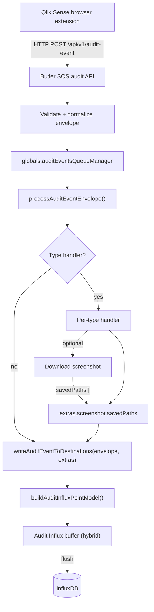
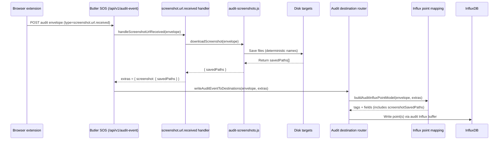
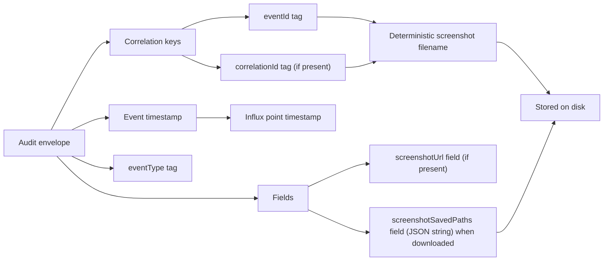

# WIP: Audit Events → InfluxDB Destination (Design + Implementation Plan)

Status: work in progress.

Implementation status (as of 2025-12-26):

- Audit events can be written to an audit-specific InfluxDB destination under `Butler-SOS.auditEvents.destination.*`.
- Writes are buffered using a hybrid strategy (hybrid buffer): flush on interval (`writeFrequency`); flush immediately at `maxBatchSize`; if `writeFrequency` is `0`, flush per event.
- Audit InfluxDB v3 uses `writeTimeout`; audit v3 does **not** support `queryTimeout`.

## Goals

- Persist incoming audit events (from the Qlik Sense browser extension) into InfluxDB.
- Store data so it is easy to answer who looked at what, when they looked, and for how long.
- Ensure audit data can be stored in a _separate_ InfluxDB database/bucket/instance/version from the rest of Butler SOS metrics.
- Ensure audit data can be correlated with screenshots saved to disk.
- Implement a flexible “audit destination” concept so more destinations can be added later (InfluxDB is first).

## How It Works (Diagrams)

### End-to-end data flow



### Screenshot handling (sequence)



### Determinism & correlation



## Non-goals (for the first iteration)

- Perfect semantic modeling for all possible audit event types.
- Server-side sessionization across long periods (beyond storing events/durations).
- Retroactive updates of stored points (Influx points are immutable).

## Inputs / Current Behavior

### Audit ingest

- Butler SOS receives audit events via HTTP POST to `/api/v1/audit-event` (implementation: `src/lib/audit-events-api.js`).
- The POST body is an envelope with fields: `schemaVersion`, `eventId`, optional `correlationId`, `timestamp`, `type`, `payload`.
- Events are processed via `globals.auditEventsQueueManager` (a `UdpQueueManager` used for HTTP ingest too).

### Screenshot download

- Event type: `screenshot.url.received`
- Butler SOS may download screenshots referenced by events (implementation: `src/lib/audit-screenshots.js`). Filenames are deterministic and include `correlationId` + `eventId`.

### Extension “view duration” event

- The extension already emits a duration metric on object visibility: envelope type `object.visibility.changed`, payload includes `payload.event.duration` (milliseconds) and `payload.event.objectId`.

## Configuration

All new config lives under:

- `Butler-SOS.auditEvents.destination.*`

### Proposed config structure

```yaml
Butler-SOS:
    auditEvents:
        destination:
            enable: false
            type: influxdb # future: more destination types

            # Versioned Influx settings (separate from Butler-SOS.influxdbConfig.*)
            influxdb:
                host: 127.0.0.1
                port: 8086
                version: 2 # 1 | 2 | 3

                # Buffering (hybrid)
                # - writeFrequency > 0: buffer and flush on interval.
                # - writeFrequency == 0: flush each event immediately.
                # - maxBatchSize: flush immediately when buffer reaches this size.
                maxBatchSize: 1000
                writeFrequency: 20000

                # Shared controls
                measurementName: audit_event
                auditEventSchemaVersion: '1' # stored as tag
                staticTags: [] # optional: array of {name,value}

                v1Config:
                    dbName: butler-audit
                    retentionPolicy:
                        name: autogen
                    auth:
                        enable: false
                        username: ''
                        password: ''

                v2Config:
                    org: my-org
                    bucket: butler-audit
                    description: Audit events bucket
                    token: '<token>'
                    retentionDuration: 0s

                v3Config:
                    database: butler_audit
                    description: Audit events database
                    token: '<token>'
                    retentionDuration: 0s
                    writeTimeout: 10000
```

Notes:

- `auditEvents.enable` controls whether the audit API server runs.
- `auditEvents.destination.enable` controls whether Butler SOS writes received audit events to destinations.
- The audit destination Influx config is intentionally separate from `Butler-SOS.influxdbConfig.*` (used by existing Butler SOS features).
- Audit InfluxDB v3 does not support `queryTimeout` in the audit destination config.

### Startup initialization (v1/v2 only)

- When `auditEvents.enable=true` and `auditEvents.destination.enable=true`, Butler SOS will attempt to ensure the configured audit Influx target exists at startup:
    - InfluxDB v1: create database + retention policy if missing.
    - InfluxDB v2: create bucket if missing (uses `v2Config.description`).
- InfluxDB v3 is **not** auto-created (same as metrics InfluxDB v3); you must create the database ahead of time.

### Required description fields

- When `auditEvents.destination.enable=true`:
    - InfluxDB v2 requires `v2Config.description`.
    - InfluxDB v3 requires `v3Config.description`.

## Destination Concept

Introduce a minimal interface:

- `AuditDestination`: `id: string`, `writeAuditEvent(envelope, extras): Promise<void>`

Create a small registry/factory:

- `createAuditDestinationsFromConfig()` returns a list of enabled destinations.
- For now only `influxdb` is implemented.

This allows future destinations (Kafka, S3, Postgres, etc) to be added without touching the HTTP ingress logic.

## InfluxDB Storage Model

### Measurement strategy

- Single measurement for all audit events. Default name: `audit_event`.

Reason:

- Matches existing Butler SOS pattern where one measurement represents an “event family”, and subtype is expressed using tags.
- Simplifies Grafana dashboards and templating.

### Tags (indexed)

Always attempt to set these tags:

- `eventType` (envelope.type)
- `eventId` (envelope.eventId)
- `correlationId` (envelope.correlationId, optional)
- `selectionTxnId` (if present in payload.event.selectionTxnId)
- `userId` (payload.context.user if present)
- `appId` (payload.context.appId)
- `appName` (payload.context.appName)
- `auditEventSchemaVersion` (from config, low cardinality)

Optional tags (only if stable/low-cardinality and present):

- `source` fields (if used later)

### Fields (non-indexed)

Common fields:

- `sheetId` (payload.context.sheetId)
- `sheetName` (payload.context.sheetName)
- `objectId` (payload.event.objectId)

Duration-related fields:

- `durationMs` (payload.event.duration for `object.visibility.changed`)
- `visible` (payload.event.visible for `object.visibility.changed`)

Screenshot-related fields:

- `screenshotUrl` (payload.event.screenshotUrl for `screenshot.url.received`)
- `screenshotSavedPaths` (string or JSON string) when Butler SOS downloads the screenshot

### Timestamp

- Use the event timestamp as the point timestamp (`envelope.timestamp`, parsed as date-time).

### Schema evolution

- `auditEventSchemaVersion` is a tag (low cardinality). This makes it easy to filter dashboards and to run dual-writing migrations if needed.

## Screenshot Correlation

Correlation must work even if the screenshot is only stored on disk.

- Always store `eventId` and `correlationId` as tags.
- Screenshot files use deterministic filenames including `correlationId` and `eventId` (see `src/lib/audit-screenshots.js`).
- When download is enabled, Butler SOS should also store `screenshotSavedPaths` as a field on the _same_ `screenshot.url.received` point (by writing after download), or write a second point such as `eventType=screenshot.downloaded`.

## Implementation Notes (Butler SOS)

### Wiring point

- The correct place to write to destinations is `processAuditEventEnvelope()` in `src/lib/audit-events-api.js`.
- Flow:
    1. Validate payload.
    2. Run type handler (e.g. screenshot download).
    3. Write to destinations, passing any handler-produced `extras`.

### Handler extras

- `screenshot.url.received` handler should return `extras.screenshot.savedPaths: string[]`.

### Influx versions

InfluxDB v1/v2/v3 are supported by the audit destination.

The current implementation uses a single buffering module that:

- builds a version-agnostic point model,
- converts it to a version-specific point representation,
- buffers points in memory,
- flushes in batches using progressive batch sizes.

Key modules:

- `src/lib/audit-destinations/influxdb/buffer.js`
- `src/lib/audit-destinations/influxdb/factory.js`
- `src/lib/audit-destinations/influxdb/v1/audit-events.js`
- `src/lib/audit-destinations/influxdb/v2/audit-events.js`
- `src/lib/audit-destinations/influxdb/v3/audit-events.js`

The per-version modules exist for compatibility/experimentation, but the default write path uses the hybrid buffer.

## Implementation Notes (Docs)

- Add WIP docs page in the docs site (`butler-sos-docs/docs/docs/...`) describing config keys, measurement schema, correlation fields, and security considerations.

## Security

- Audit data is sensitive.
- The audit destination must allow a separate InfluxDB instance/version/bucket/database.
- Avoid logging full payloads at info-level in production; keep detailed logs behind debug/silly.
