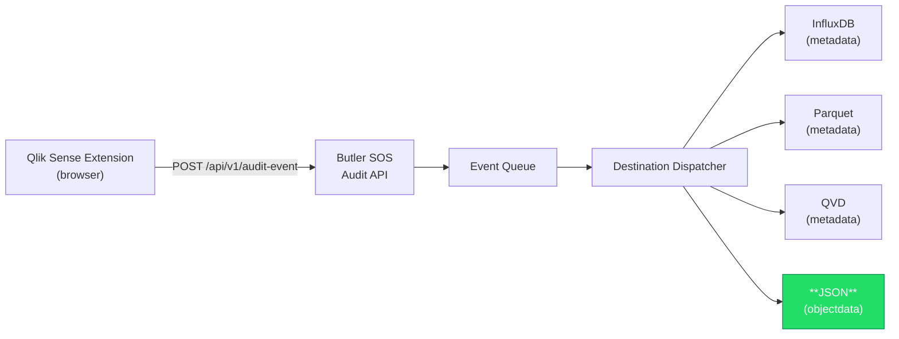
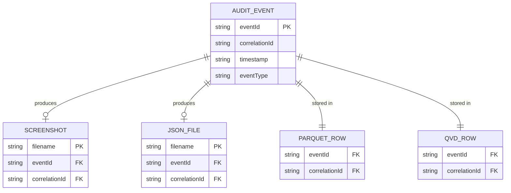
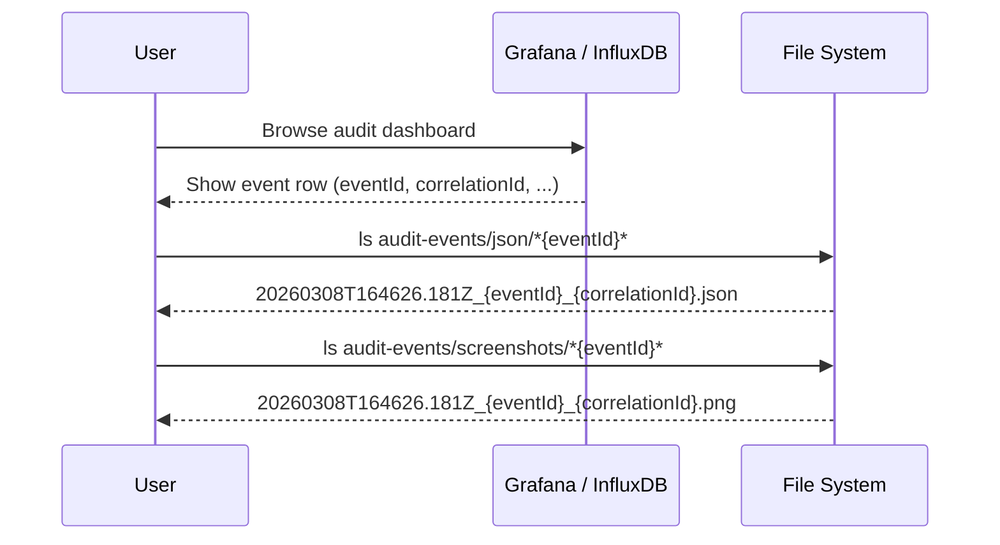
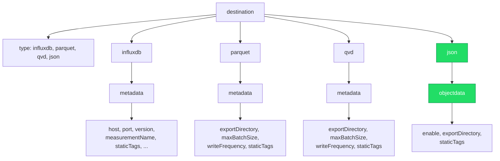

# Audit Events: Object Data JSON Destination

## Overview

The **JSON object data destination** writes the `objectData` property from each audit event to
individual JSON files on disk. This destination is purpose-built for capturing the rich
dimensional and measure data that Qlik Sense visualization objects expose at the time an
audit event is recorded.

Each audit event that contains `objectData` produces one JSON file. Events without
`objectData` are silently skipped.

## Data Flow



## File Naming & Correlation

JSON files use the **same naming convention as screenshots**, making it trivial to
correlate a screenshot image with its object data:

```
{timestamp}_{eventId}_{correlationId}.json
```

Example:

```
20260308T164626.181Z_165c9558-abcd-1234-a1b2-cc12e5aa9f01_cc12e5aa-beef-4321-9876-abcdef012345.json
```

### Correlation Model



All four file types share `eventId` and `correlationId`. A simple directory listing +
`grep` on these IDs links every artefact for a given event:

```bash
# Find all files for a specific event
find audit-events/ -name "*165c9558*"
```

### Cross-Destination Lookup



## JSON File Format

Each file is a single JSON object containing the full event context alongside the
object data payload:

```json
{
  "eventId": "165c9558-abcd-1234-a1b2-cc12e5aa9f01",
  "correlationId": "cc12e5aa-beef-4321-9876-abcdef012345",
  "timestamp": "2026-03-08T16:46:26.181Z",
  "eventType": "screenshot.url.received",
  "userId": "LAB\\johndoe",
  "appId": "a1b2c3d4-e5f6-7890-abcd-ef1234567890",
  "appName": "Sales Dashboard",
  "sheetId": "sheet01",
  "sheetName": "Overview",
  "objectId": "obj123",
  "objectType": "barchart",
  "selectionTxnId": "txn-abc-123",
  "durationMs": 1500,
  "visible": true,
  "enteredAt": "2026-03-08T16:46:24.681Z",
  "leftAt": null,
  "dataStateId": null,
  "screenshotUrl": "https://qliksense.company.com/.../screenshot.png",
  "screenshotSavedPaths": [
    "/data/audit-events/screenshots/20260308T164626.181Z_165c9558-..._cc12e5aa-....png"
  ],
  "selectionDetails": [
    { "fieldName": "Region", "selectedValues": ["Europe", "Asia"] }
  ],
  "objectData": {
    "schemaVersion": 1,
    "objectType": "barchart",
    "extractedAt": "2026-03-08T16:46:26.000Z",
    "dimensions": [
      {
        "fieldName": "Product",
        "label": "Product Category",
        "values": ["Electronics", "Clothing", "Food"]
      }
    ],
    "measures": [
      {
        "label": "Total Sales",
        "values": ["125000", "89000", "67000"]
      }
    ]
  },
  "tags": {
    "env": "production",
    "datacenter": "eu-north-1"
  }
}
```

## Configuration

The JSON destination is configured under
`Butler-SOS.auditEvents.destination.json.objectdata`:

```yaml
Butler-SOS:
  auditEvents:
    destination:
      enable: true
      type: influxdb, parquet, qvd, json    # Add 'json' to the type list

      json:
        objectdata:
          enable: true
          exportDirectory: ./audit-events/json
          staticTags:
            - name: env
              value: production
            - name: datacenter
              value: eu-north-1
```

### Configuration Properties

| Property | Type | Required | Default | Description |
|---|---|---|---|---|
| `enable` | boolean | Yes | — | Enable/disable the JSON objectdata destination |
| `exportDirectory` | string | Yes | — | Directory where JSON files are written |
| `staticTags` | array | No | `[]` | Key-value pairs included as `tags` in every JSON file |

## Destination Architecture

All audit destinations follow a two-level structure with `metadata` and
`objectdata` sub-sections:



- **`metadata`** — Event metadata (timestamps, IDs, tags). This is where existing
  settings for InfluxDB, Parquet, and QVD live.
- **`objectdata`** — The raw dimension/measure payload from the Qlik Sense object.
  Currently only the `json` destination supports this sub-section.

> **Note:** The `objectdata` sub-section may be added to Parquet, QVD, and InfluxDB
> destinations in the future. The `metadata` sub-sections for those destinations
> always include `objectData` as a JSON-stringified field in every row.

