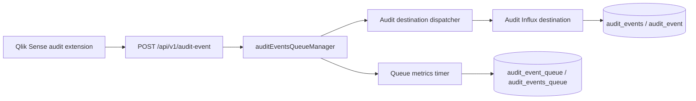

# Audit Events: InfluxDB Data Model

This document describes the audit-related data that Butler SOS writes to InfluxDB.

There are two separate write paths:

- Audit event metadata: one point per accepted audit event. The measurement name is configured by `Butler-SOS.auditEvents.destination.influxdb.metadata.measurementName`. The current fallback/default in code is `audit_event`; deployments may configure this as `audit_events`.
- Audit event queue metrics: one point per queue metrics sample. The measurement name is configured by `Butler-SOS.auditEvents.queue.queueMetrics.influxdb.measurementName`. The current default is `audit_events_queue`; deployments may configure this as `audit_event_queue`.

## Data Flow



The two measurements use different InfluxDB configuration roots:

| Data | Config root | InfluxDB connection used |
| :--- | :--- | :--- |
| Audit event metadata | `Butler-SOS.auditEvents.destination.influxdb.metadata` | Audit-specific InfluxDB destination. This can point to a separate host, database, bucket, or InfluxDB version from other Butler SOS metrics. |
| Audit event queue metrics | `Butler-SOS.auditEvents.queue.queueMetrics.influxdb` | Regular Butler SOS InfluxDB metrics connection under `Butler-SOS.influxdbConfig.*`. |

Both write paths support InfluxDB v1, v2, and v3.

## Audit Event Measurement

The audit event measurement stores one InfluxDB point for each audit event accepted by Butler SOS and routed to the `influxdb` audit destination.

The measurement name comes from:

```yaml
Butler-SOS:
    auditEvents:
        destination:
            influxdb:
                metadata:
                    measurementName: audit_events
```

If `measurementName` is missing or empty, Butler SOS falls back to `audit_event`.

### Timestamp

The point timestamp is parsed from the top-level audit envelope field `timestamp`.

```json
{
    "timestamp": "2026-03-08T16:46:26.181Z"
}
```

If the timestamp is missing or cannot be parsed, Butler SOS does not set an explicit point timestamp and the InfluxDB client/server write time is used.

### Audit Event Tags

Tags are indexed in InfluxDB and should be used for filtering and grouping. Butler SOS writes only tags that have usable values, except for `eventType` and `auditEventSchemaVersion`, which are always set.

| Tag | Source | When written | Notes |
| :--- | :--- | :--- | :--- |
| `eventType` | `envelope.type` | Always | Falls back to `unknown` if the event type is missing or empty. Examples: `screenshot.url.received`, `object.view.duration`, `selection.state.changed`. |
| `auditEventSchemaVersion` | `Butler-SOS.auditEvents.destination.influxdb.metadata.auditEventSchemaVersion` | Always | Stored as a string. Falls back to `1` if the config value is missing. |
| `eventId` | `envelope.eventId` | When non-empty string | Unique event ID generated by the audit extension. |
| `correlationId` | `envelope.correlationId` | When non-empty string | Used to link related audit events, screenshots, and object data files. |
| `selectionTxnId` | `payload.event.selectionTxnId` | When non-empty string | Selection transaction ID captured by the audit extension. |
| `userId` | `payload.context.user` | When non-empty string | Qlik Sense user identifier. |
| `appId` | `payload.context.appId` | When non-empty string | Qlik Sense app ID. |
| `appName` | `payload.context.appName` | When non-empty string | Qlik Sense app name. |
| `objectType` | `payload.event.objectData.objectType` | When `objectData` exists and contains `objectType` | Visualization type, for example `barchart`, `table`, or `pivot-table`. |
| Configured static tags | `Butler-SOS.auditEvents.destination.influxdb.metadata.staticTags[]` | When configured | Each `{name, value}` pair is written as a tag. Static tags can overwrite earlier tag values if the same name is reused. |

### Audit Event Fields

Fields are not indexed in InfluxDB. Butler SOS writes only fields that have a usable value.

| Field | Influx type | Source | When written | Notes |
| :--- | :--- | :--- | :--- | :--- |
| `sheetId` | string | `payload.context.sheetId` | When non-empty string | Qlik Sense sheet ID. |
| `sheetName` | string | `payload.context.sheetName` | When non-empty string | Qlik Sense sheet name. |
| `objectId` | string | `payload.event.objectId` | When non-empty string | Qlik Sense object ID. |
| `durationMs` | number | `payload.event.duration` | When finite number | Mainly used by `object.view.duration`. Stored as a numeric field. |
| `visible` | boolean | `payload.event.visible` | When boolean | Mainly used by `object.view.duration`; usually `false` when the object leaves view. |
| `enteredAt` | string | `payload.event.enteredAt` | When non-empty string | ISO timestamp for when the object entered view. |
| `leftAt` | string | `payload.event.leftAt` | When non-empty string | ISO timestamp for when the object left view. |
| `enterSelectionTxnId` | string | `payload.event.enterSelectionTxnId` | When non-empty string | Selection transaction ID snapshot from when the object entered view. |
| `leaveSelectionTxnId` | string | `payload.event.leaveSelectionTxnId` | When non-empty string | Selection transaction ID snapshot from when the object left view. |
| `dataStateId` | number | `payload.event.dataStateId`, otherwise handler extra `dataStateId` | When finite number | High-cardinality data state identifier, often timestamp-like. |
| `selectionDetails` | string | Handler extra from `selection.state.changed` | When selection details array is non-empty | JSON string. Each item contains the reduced selection fields `qField`, `qSelectedCount`, and `qSelected`. |
| `screenshotUrl` | string | `payload.event.screenshotUrl` | When non-empty string | URL received from the Qlik Sense extension for `screenshot.url.received`. |
| `screenshotSavedPaths` | string | Handler extra from screenshot download | When at least one screenshot was saved locally | JSON string containing an array of local file paths. |
| `objectData` | string | `payload.event.objectData` | When `objectData` is an object | JSON string containing extracted visualization data, including dimensions and measures. Can be large. |

Numeric audit event fields are written as floating point values by the v2/v3 audit event writer. Queue metrics use explicit integer fields where appropriate; see [Audit Event Queue Measurement](#audit-event-queue-measurement).

### Object Data Field

When present, `objectData` is stored as a JSON-stringified InfluxDB field. It is also the source of the `objectType` tag.

Typical structure:

```json
{
    "schemaVersion": 1,
    "objectType": "barchart",
    "extractedAt": "2026-03-08T16:46:26.000Z",
    "visibleRange": {
        "rowStart": 0,
        "rowEnd": 10,
        "colStart": 0,
        "colEnd": 4,
        "source": "scroll-state"
    },
    "dimensions": [
        {
            "fieldName": "Region",
            "label": "Sales Region",
            "values": ["North", "South", "East", "West"]
        }
    ],
    "measures": [
        {
            "label": "Revenue",
            "values": ["15000.50", "22000.00", "18500.75", "30000.00"]
        }
    ]
}
```

Butler SOS does not currently have an InfluxDB-specific `includeObjectData` switch. If `payload.event.objectData` is present, it is stored in the audit event point.

### Event Types

The audit API has specific payload validation and logging handlers for these event types:

| Event type | Typical InfluxDB data populated |
| :--- | :--- |
| `selection.transaction.finalized` | `eventType`, `eventId`, `correlationId`, `selectionTxnId`, user/app/sheet tags and fields when present. The full before/after selection arrays are accepted by the API but are not written to the InfluxDB audit event point. |
| `selection.state.changed` | Common tags and fields plus `selectionDetails` as a JSON string containing reduced selection details. |
| `app.model.validated` | Common tags and fields plus `selectionTxnId` and `dataStateId` when present. |
| `screenshot.url.received` | Common tags and fields plus `objectId`, `dataStateId`, `screenshotUrl`, optional `screenshotSavedPaths`, optional `objectData`, and optional `objectType` tag. |
| `event.unsupported.visualization` | Common tags and fields plus `objectId`, `selectionTxnId`, and `dataStateId` when present. `vizType`, `title`, and `trigger` are logged but are not written to the InfluxDB audit event point. |
| `object.view.duration` | Common tags and fields plus `objectId`, `durationMs`, `visible`, `enteredAt`, `leftAt`, `enterSelectionTxnId`, `leaveSelectionTxnId`, `selectionTxnId`, and `dataStateId` when present. |
| Unknown event types | Accepted by the API and stored using the same generic mapping. Only the common context fields and recognized `payload.event.*` properties listed in this document are written. |

### Accepted But Not Stored

The audit envelope and payload are intentionally forward-compatible. Extra top-level properties, `source`, and additional `payload` or `payload.event` properties may be accepted by the API, but they are not automatically stored in InfluxDB.

Notable examples that are validated or logged but not stored as Influx fields today:

- `envelope.source.*`
- `payload.event.beforeSelections`
- `payload.event.afterSelections`
- `payload.event.captureScheduled`
- `payload.event.vizType`
- `payload.event.title`
- `payload.event.trigger`
- Any other custom fields that are not listed in [Audit Event Fields](#audit-event-fields)

## Audit Event Queue Measurement

The audit event queue measurement stores operational metrics for the in-memory `auditEventsQueueManager` used by the HTTP audit API. It is useful for dashboards and alerts around queue pressure, dropped audit events, processing failures, and processing latency.

The measurement name comes from:

```yaml
Butler-SOS:
    auditEvents:
        queue:
            queueMetrics:
                influxdb:
                    measurementName: audit_event_queue
```

If using the current sample/default config, the name is `audit_events_queue`.

### Sampling and Timestamp

Queue metrics are written on a timer controlled by `Butler-SOS.auditEvents.queue.queueMetrics.influxdb.writeFrequency`.

The queue metrics point does not set an explicit event timestamp. InfluxDB uses the write time as the point timestamp.

After a queue metrics point is successfully written, Butler SOS clears the interval counters and processing-time buffer. That means message counters and processing time fields describe activity since the previous successful queue metrics write, while queue size, pending count, rate limit state, and backpressure state describe the queue at sample time.

### Queue Terminology

The audit API uses an in-memory `auditEventsQueueManager` to process accepted HTTP audit events without making the browser wait for destination writes. The queue manager is shared infrastructure originally built for UDP events, but for audit events it is used by the HTTP audit API.

| Term | Meaning |
| :--- | :--- |
| Accepted audit event | An HTTP `POST /api/v1/audit-event` request that passed the envelope schema and, for known event types, the event-specific payload validation. Accepted events return `202 Accepted` even when later queue processing or destination writing fails. |
| Queue job | The asynchronous unit of work added to the in-memory queue. For audit events, one queue job processes one accepted audit event envelope and writes it to enabled destinations. |
| Waiting / queued job | A queue job that has been accepted by the queue manager but has not started running yet. In the code this is `queue.size`. |
| Active / running job | A queue job that is currently executing (it has left the waiting queue and is occupying one of the concurrency slots). In p-queue's API this counter is confusingly named `queue.pending` — **not** because the job is waiting, but because of p-queue's internal naming convention. The InfluxDB field derived from it is `queue_running`. |
| Processed job | A queue job whose processing function completed without throwing. Destination writers may log and swallow their own errors, so `messages_processed` primarily means the queue job completed, not that every destination definitely persisted the event. |
| Failed job | A queue job whose processing function threw an error. |
| Dropped message | A message seen by the queue manager but not accepted into the queue. Drops can happen because of queue rate limiting, full queue, or size validation. |
| Rate limiting | Optional queue-level throttling that rejects messages when more than `maxMessagesPerMinute` messages arrive during the current fixed one-minute window. This is separate from the Fastify HTTP rate limit on the audit API. |
| Backpressure | A warning state that means waiting queue depth has reached the configured `backpressureThreshold` percentage of `messageQueue.maxSize`. It is a signal that arrivals are outpacing processing and the queue is building a backlog. Backpressure clears when waiting queue depth drops below 80% of that threshold. |
| Queue utilization | The percentage of waiting queue slots currently occupied. It does not include pending/running jobs. |

### Point-In-Time And Interval Metrics

Queue metrics mix two kinds of values:

| Metric style | Fields | Meaning |
| :--- | :--- | :--- |
| Point-in-time gauges | `queue_size`, `queue_utilization_pct`, `queue_running`, `rate_limit_current`, `backpressure_active` | The queue state at the exact moment the metrics timer runs. Short bursts can be missed if they start and finish between samples. |
| Interval counters | `messages_received`, `messages_queued`, `messages_processed`, `messages_failed`, `messages_dropped_*` | Counts accumulated since the previous successful queue metrics write. They are reset after the metrics point is written. |
| Interval processing times | `processing_time_avg_ms`, `processing_time_p95_ms`, `processing_time_max_ms` | Processing-time summary for jobs completed since the previous successful queue metrics write. The underlying processing-time buffer is reset after the metrics point is written. |

With the sample/default config, queue metrics are written every `20000` ms. A backlog that exists only for a fraction of a second can therefore be real, but never appear in `queue_size` or `queue_utilization_pct` if the sampler does not run during that fraction of a second.

### Understanding `queue_utilization_pct`

`queue_utilization_pct` is calculated from waiting queue depth only:

```text
queue_utilization_pct = queue_size / queue_max_size * 100
```

For the audit event queue, the default/sample settings are:

```yaml
Butler-SOS:
    auditEvents:
        queue:
            messageQueue:
                maxConcurrent: 10
                maxSize: 200
                backpressureThreshold: 80
```

This means up to 10 audit jobs can be running at the same time without increasing `queue_size`. If 1 to 10 events arrive and Butler SOS can start processing them immediately, `queue_running` may rise, `messages_queued` and `messages_processed` may increase, and processing-time fields may change, while `queue_utilization_pct` remains `0`.

Even when one job briefly waits, the default `maxSize` of `200` makes the utilization small:

```text
1 waiting job / 200 max queue size * 100 = 0.5%
```

On a Grafana chart with a 0-100 y-axis, 0.5% can look flat. If that waiting job starts before the next 20-second metrics sample, the stored `queue_utilization_pct` point will still be `0`.

Use `queue_utilization_pct` to detect sustained backlog pressure, not to count audit events or show every short burst. For quick selections in a Sense app, the expected dashboard behavior is often:

- `messages_queued` increases when accepted audit events enter the queue.
- `messages_processed` increases when queue jobs complete.
- `processing_time_*` fields may change when jobs take measurable time.
- `queue_running` may show running work only if the metrics timer samples while jobs are still running.
- `queue_utilization_pct` changes only when jobs are waiting, and only if that waiting state exists when the metrics timer samples it.

If the goal is to show active work during short bursts, `queue_running` is usually more informative than `queue_utilization_pct`. If the goal is to detect overload, use `queue_utilization_pct`, `messages_dropped_queue_full`, and `backpressure_active` together.

### Queue Metric Tags

| Tag | Source | When written | Notes |
| :--- | :--- | :--- | :--- |
| `queue_type` | Constant | Always | Always `audit_events` for the audit event queue. |
| `host` | Butler SOS host info | Always | Hostname of the Butler SOS instance writing the metric. |
| Configured queue metric tags | `Butler-SOS.auditEvents.queue.queueMetrics.influxdb.tags[]` | When configured | Each `{name, value}` pair is written as a tag. |

### Queue Metric Fields

| Field | Influx type | Source metric | Description |
| :--- | :--- | :--- | :--- |
| `queue_size` | integer | `queueSize` | Number of queued audit jobs waiting to run. |
| `queue_max_size` | integer | `queueMaxSize` | Configured max queue size from `Butler-SOS.auditEvents.queue.messageQueue.maxSize`. |
| `queue_utilization_pct` | float | `queueUtilizationPct` | `queue_size / queue_max_size * 100`. This measures waiting backlog only; it does not include currently running jobs. |
| `queue_running` | integer | `queuePending` | Number of queue jobs **currently running** (occupying concurrency slots). Despite the "pending" name — inherited from p-queue's `queue.pending` property — these jobs are actively executing, not waiting. They have already left the waiting queue and do not contribute to `queue_utilization_pct`. |
| `messages_received` | integer | `messagesReceived` | Number of messages seen by the queue manager since the last successful metrics write. Includes queued and dropped messages. |
| `messages_queued` | integer | `messagesQueued` | Number of messages accepted into the queue since the last successful metrics write. A message can be queued and processed without ever causing visible `queue_utilization_pct` if it starts running immediately. |
| `messages_processed` | integer | `messagesProcessed` | Number of queue jobs that completed successfully since the last successful metrics write. This is a queue-processing success signal, not a guaranteed per-destination persistence acknowledgement. |
| `messages_failed` | integer | `messagesFailed` | Number of queue jobs that failed since the last successful metrics write. |
| `messages_dropped_total` | integer | `messagesDroppedTotal` | Total messages dropped since the last successful metrics write. |
| `messages_dropped_rate_limit` | integer | `messagesDroppedRateLimit` | Messages dropped because audit queue rate limiting rejected them. |
| `messages_dropped_queue_full` | integer | `messagesDroppedQueueFull` | Messages dropped because the queue was already at or above `queue_max_size`. |
| `messages_dropped_size` | integer | `messagesDroppedSize` | Messages dropped because they exceeded the configured max message size. For audit HTTP ingest this is normally `0`, because the audit queue config does not set `maxMessageSize`. |
| `processing_time_avg_ms` | float | `processingTimeAvgMs` | Average queue job processing time in milliseconds, based on the processing-time buffer since the last successful metrics write. |
| `processing_time_p95_ms` | float | `processingTimeP95Ms` | 95th percentile queue job processing time in milliseconds. |
| `processing_time_max_ms` | float | `processingTimeMaxMs` | Maximum queue job processing time in milliseconds. |
| `rate_limit_current` | integer | `rateLimitCurrent` | Current estimated message rate from the queue rate limiter, or `0` when queue rate limiting is disabled. |
| `backpressure_active` | integer | `backpressureActive` | `1` when waiting queue depth has reached the configured backpressure threshold, otherwise `0`. |

## Minimal Query Examples

InfluxQL-style examples for v1:

```sql
-- Count audit events by type.
SELECT COUNT("objectId") FROM "audit_events" GROUP BY "eventType"

-- Find screenshot events for one app.
SELECT "objectId", "sheetName", "screenshotSavedPaths"
FROM "audit_events"
WHERE "eventType" = 'screenshot.url.received' AND "appId" = 'a1b2c3d4'

-- Monitor dropped audit queue messages.
SELECT "messages_dropped_total", "messages_dropped_queue_full", "messages_dropped_rate_limit"
FROM "audit_event_queue"
```

SQL-style examples for InfluxDB v3:

```sql
-- Latest audit queue state.
SELECT time, host, queue_size, queue_running, backpressure_active
FROM audit_event_queue
ORDER BY time DESC
LIMIT 20;

-- Object view durations by app and sheet.
SELECT time, appName, sheetName, objectId, durationMs
FROM audit_events
WHERE eventType = 'object.view.duration'
ORDER BY time DESC;
```

Adjust the measurement names in the queries if your config uses `audit_event` or `audit_events_queue`.
