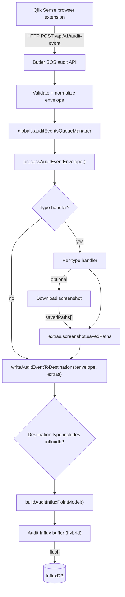
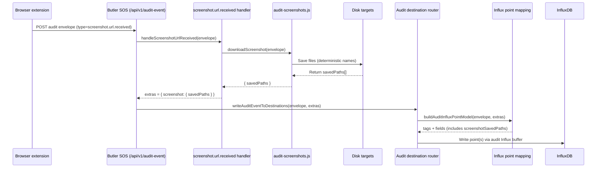
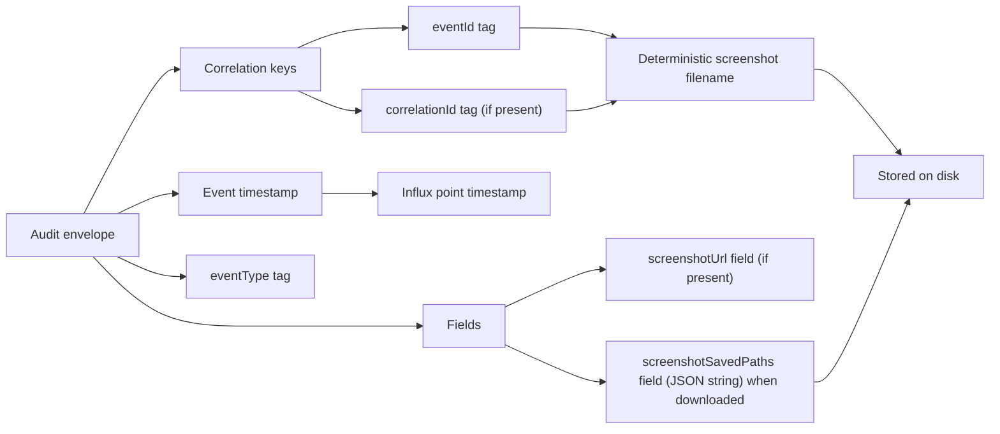

# Audit Events: InfluxDB Destination

Current implementation:

- Audit events are written to an audit-specific InfluxDB destination under `Butler-SOS.auditEvents.destination.influxdb.metadata` when the audit destination is enabled and `destination.type` includes `influxdb`.
- Writes are buffered using a hybrid strategy (hybrid buffer): flush on interval (`writeFrequency`); flush immediately at `maxBatchSize`; if `writeFrequency` is `0`, flush per event.
- Audit InfluxDB v3 uses `writeTimeout`; audit v3 does **not** support `queryTimeout`.
- The destination dispatcher supports `influxdb`, `parquet`, `qvd`, and `json` in a comma-delimited `destination.type` string.

## Purpose

- Persist incoming audit events from the Qlik Sense browser extension into InfluxDB.
- Store data so it is easy to answer who looked at what, when they looked, and for how long.
- Store audit data in a separate InfluxDB database, bucket, instance, or version from regular Butler SOS metrics when needed.
- Correlate audit events with screenshots saved to disk.
- Use the shared audit destination dispatcher while keeping audit InfluxDB storage independent from the regular Butler SOS metrics destination.

## How It Works (Diagrams)

### End-to-end data flow



### Screenshot handling (sequence)



### Determinism & correlation



## Scope And Limits

- Perfect semantic modeling for all possible audit event types.
- Server-side sessionization across long periods (beyond storing events/durations).
- Retroactive updates of stored points (Influx points are immutable).

## Inputs / Current Behavior

### Audit ingest

- Butler SOS receives audit events via HTTP POST to `/api/v1/audit-event` (implementation: `src/lib/audit-events-api.js`).
- Butler SOS also exposes `GET /api/v1/test-connection` for connection tests.
- If `Butler-SOS.auditEvents.apiToken` is configured, requests require `Authorization: Bearer <token>`.
- Browser requests are controlled by `Butler-SOS.auditEvents.cors.allowedOrigins`.
- The HTTP layer also applies a Fastify rate limit of 300 requests per minute.
- The POST body is an envelope with required fields `schemaVersion`, `eventId`, `timestamp`, `type`, and `payload`. `correlationId` and `source` are optional. Additional top-level and payload fields are accepted for forward compatibility.
- Known event types with payload validation are `selection.transaction.finalized`, `selection.state.changed`, `app.model.validated`, `screenshot.url.received`, `event.unsupported.visualization`, and `object.view.duration`. Unknown event types are accepted and stored using the open envelope/payload model.
- Events are processed via `globals.auditEventsQueueManager` (a `UdpQueueManager` used for HTTP ingest too).

### Screenshot download

- Event type: `screenshot.url.received`
- Butler SOS may download screenshots referenced by events (implementation: `src/lib/audit-screenshots.js`). Filenames are deterministic and include `correlationId` + `eventId`.

### Extension “view duration” event

- The extension emits a duration metric when an audited object leaves the viewport: envelope type `object.view.duration`.
- **Emission threshold:** The event is only sent when `durationMs >= 1000` (i.e. object was visible for at least 1 second). This reduces noise from fast scrolling or brief view changes.
- Payload includes `payload.event.objectId` (Qlik object id).
- Payload includes `payload.event.enteredAt` (ISO string, best effort; may be `null`).
- Payload includes `payload.event.leftAt` (ISO string).
- Payload includes `payload.event.duration` (milliseconds).
- Payload includes `payload.event.visible=false` (this event represents leaving view).
- Payload includes `payload.event.enterSelectionTxnId` and `payload.event.leaveSelectionTxnId` (best-effort snapshots).
- `payload.event.selectionTxnId` is set to `leaveSelectionTxnId` when available, otherwise `enterSelectionTxnId` (used for correlationId/tagging).

Example envelope (`object.view.duration`):

```json
{
    "schemaVersion": 1,
    "eventId": "9d8d66f6-9df8-4a8c-a4a6-5d0c6e0c1f9e",
    "correlationId": "0346f48f-0abb-4786-b1ce-52f8672f6a1b",
    "timestamp": "2025-12-27T05:46:40.337Z",
    "type": "object.view.duration",
    "source": {
        "kind": "qlik-sense-extension",
        "name": "butler-sos-audit"
    },
    "payload": {
        "timestamp": "2025-12-27T05:46:40.337Z",
        "context": {
            "appId": "7d5f6e2a-1111-2222-3333-444444444444",
            "appName": "Operations Dashboard",
            "user": "ACME\\jane.doe",
            "userAgent": "Mozilla/5.0 (...)",
            "sheetId": "a1b2c3d4-e5f6-7890-abcd-ef0123456789",
            "sheetName": "Overview"
        },
        "event": {
            "type": "view.duration",
            "objectId": "WpLRKj",
            "enteredAt": "2025-12-27T05:46:20.337Z",
            "leftAt": "2025-12-27T05:46:40.337Z",
            "duration": 20000,
            "visible": false,
            "selectionTxnId": "0346f48f-0abb-4786-b1ce-52f8672f6a1b",
            "enterSelectionTxnId": "0aa00000-0000-0000-0000-000000000000",
            "leaveSelectionTxnId": "0346f48f-0abb-4786-b1ce-52f8672f6a1b",
            "dataStateId": 1766814362573
        }
    }
}
```

## Configuration

Audit InfluxDB destination config lives under:

- `Butler-SOS.auditEvents.destination.influxdb.metadata`

### Config structure

```yaml
Butler-SOS:
    auditEvents:
        destination:
            enable: false
            type: influxdb # Comma-delimited list: influxdb, parquet, qvd, json

            # Versioned Influx settings (separate from Butler-SOS.influxdbConfig.*)
            influxdb:
                metadata:
                    host: 127.0.0.1
                    port: 8086
                    version: 2 # 1 | 2 | 3

                    # Buffering (hybrid)
                    # - writeFrequency > 0: buffer and flush on interval.
                    # - writeFrequency == 0: flush each event immediately.
                    # - maxBatchSize: flush immediately when buffer reaches this size.
                    maxBatchSize: 1000
                    writeFrequency: 20000

                    # Shared controls
                    measurementName: audit_event
                    auditEventSchemaVersion: '1' # stored as tag
                    staticTags: [] # optional: array of {name,value}

                    v1Config:
                        dbName: butler-audit
                        retentionPolicy:
                            name: autogen
                            duration: 10d
                        auth:
                            enable: false
                            username: ''
                            password: ''

                    v2Config:
                        org: my-org
                        bucket: butler-audit
                        description: Audit events bucket
                        token: '<token>'
                        retentionDuration: 0s

                    v3Config:
                        database: butler_audit
                        description: Audit events database
                        token: '<token>'
                        retentionDuration: 0s
                        writeTimeout: 10000
```

Notes:

- `auditEvents.enable` controls whether the audit API server runs.
- `auditEvents.destination.enable` controls whether Butler SOS writes received audit events to destinations.
- The audit destination Influx config is intentionally separate from `Butler-SOS.influxdbConfig.*` (used by existing Butler SOS features).
- Audit InfluxDB v3 does not support `queryTimeout` in the audit destination config.
- `includeObjectData` is not a current config setting. When `payload.event.objectData` is present, it is stored as an InfluxDB field and `payload.event.objectData.objectType` is stored as a tag.

### Startup initialization (v1/v2 only)

- When `auditEvents.enable=true`, `auditEvents.destination.enable=true`, and `auditEvents.destination.type` is exactly `influxdb`, Butler SOS will attempt to ensure the configured audit Influx target exists at startup (v1/v2 only).
- With a comma-delimited destination list such as `influxdb, parquet, qvd, json`, audit event writes still go to InfluxDB, but startup auto-create is skipped by the current implementation. Create the target ahead of time or use `type: influxdb` when relying on startup initialization.
- InfluxDB v1: create database + retention policy if missing.
- InfluxDB v2: create bucket if missing (uses `v2Config.description`).
- InfluxDB v3 is **not** auto-created (same as metrics InfluxDB v3); you must create the database ahead of time.

### Required Description Fields

When `auditEvents.destination.enable=true`:

- InfluxDB v2 requires `v2Config.description`.
- InfluxDB v3 requires `v3Config.description`.

## Destination Concept

The current destination dispatcher reads `Butler-SOS.auditEvents.destination.type`, splits it on commas, lowercases each destination name, and routes each accepted envelope to the matching writer. Implemented destination names are:

- `influxdb` - Buffered metadata points in InfluxDB v1/v2/v3.
- `parquet` - Buffered metadata rows in Parquet files.
- `qvd` - Buffered metadata rows in QVD files.
- `json` - One JSON file per event with `payload.event.objectData`.

Unknown destination names are logged and skipped.

## InfluxDB Storage Model

### Measurement strategy

- Single measurement for all audit events. Default name: `audit_event`.

Reason:

- Matches existing Butler SOS pattern where one measurement represents an “event family”, and subtype is expressed using tags.
- Simplifies Grafana dashboards and templating.

### Tags (indexed)

Always attempt to set these tags:

- `eventType` (envelope.type)
- `eventId` (envelope.eventId)
- `correlationId` (envelope.correlationId, optional)
- `selectionTxnId` (if present in payload.event.selectionTxnId)
- `userId` (payload.context.user if present)
- `appId` (payload.context.appId)
- `appName` (payload.context.appName)
- `objectType` (payload.event.objectData.objectType, e.g. `barchart`, `table`; only when `objectData` is present)
- `auditEventSchemaVersion` (from config, low cardinality)

The top-level envelope `source` object is accepted by the API for forward compatibility, but it is not written to the InfluxDB audit event point today.

### Fields (non-indexed)

Common fields:

- `sheetId` (payload.context.sheetId)
- `sheetName` (payload.context.sheetName)
- `objectId` (payload.event.objectId)

Duration-related fields:

- `durationMs` (payload.event.duration for `object.view.duration`)
- `visible` (payload.event.visible for `object.view.duration`)
- `enteredAt` (payload.event.enteredAt for `object.view.duration`, ISO string)
- `leftAt` (payload.event.leftAt for `object.view.duration`, ISO string)
- `enterSelectionTxnId` (payload.event.enterSelectionTxnId for `object.view.duration`)
- `leaveSelectionTxnId` (payload.event.leaveSelectionTxnId for `object.view.duration`)
- `dataStateId` (payload.event.dataStateId, or handler extra from `app.model.validated` when present)

Selection-related fields:

- `selectionDetails` (JSON string from `selection.state.changed` handler extras; each entry is reduced to `qField`, `qSelectedCount`, and `qSelected`)

Screenshot-related fields:

- `screenshotUrl` (payload.event.screenshotUrl for `screenshot.url.received`)
- `screenshotSavedPaths` (string or JSON string) when Butler SOS downloads the screenshot

Dimension data fields:

- `objectData` (JSON string containing extracted dimension/measure values from the visualization; only when `payload.event.objectData` is present; can be large; see [Object Data](#object-data) below)

### Timestamp

- Use the event timestamp as the point timestamp (`envelope.timestamp`, parsed as date-time).

### Schema evolution

- `auditEventSchemaVersion` is a tag (low cardinality). This makes it easy to filter dashboards and to run dual-writing migrations if needed.

## Screenshot Correlation

Correlation must work even if the screenshot is only stored on disk.

- Always store `eventId` and `correlationId` as tags.
- Screenshot files use deterministic filenames including `correlationId` and `eventId` (see `src/lib/audit-screenshots.js`).
- When download is enabled and at least one screenshot file is saved, Butler SOS stores `screenshotSavedPaths` as a JSON-stringified field on the same `screenshot.url.received` point.

## Implementation Notes (Butler SOS)

### Wiring point

- The correct place to write to destinations is `processAuditEventEnvelope()` in `src/lib/audit-events-api.js`.
- Flow:
    1. Validate payload.
    2. Run type handler (e.g. screenshot download).
    3. Write to destinations, passing any handler-produced `extras`.

### Handler extras

- `screenshot.url.received` returns `extras.screenshot.savedPaths: string[]` when screenshot downloads are enabled and files are saved.

### Influx versions

InfluxDB v1/v2/v3 are supported by the audit destination.

The current implementation uses a single buffering module that:

- builds a version-agnostic point model,
- converts it to a version-specific point representation,
- buffers points in memory,
- flushes in batches using progressive batch sizes.

Key modules:

- `src/lib/audit-destinations/index.js`
- `src/lib/audit-destinations/influxdb/index.js`
- `src/lib/audit-destinations/influxdb/buffer.js`
- `src/lib/audit-destinations/influxdb/factory.js`
- `src/lib/audit-destinations/influxdb/init.js`
- `src/lib/audit-destinations/influxdb/shared/client.js`
- `src/lib/audit-destinations/influxdb/shared/mapping.js`
- `src/lib/audit-destinations/influxdb/v1/audit-events.js`
- `src/lib/audit-destinations/influxdb/v2/audit-events.js`
- `src/lib/audit-destinations/influxdb/v3/audit-events.js`

The per-version modules exist for compatibility/experimentation, but the default write path uses the hybrid buffer.

## Security And Logging

- Audit data is sensitive.
- The audit destination must allow a separate InfluxDB instance/version/bucket/database.
- Known event handlers log summaries at info level and detailed payload/object data at debug level.
- Unknown event types are accepted and currently log the full envelope at info level before destination writes. Be careful when enabling unknown event types in production environments.

## Object Data

When `payload.event.objectData` is present, the `objectData` field is stored as a JSON string containing the actual dimension and measure values extracted from the visualization. The `objectType` is also extracted as a separate tag for efficient filtering.

**Important for InfluxDB**: The `objectData` field can be large (up to several MB in extreme cases). This is stored as an InfluxDB field (not a tag), so it is not indexed. There is no current destination-side `includeObjectData` switch; omit `objectData` from the incoming audit event if it should not be stored in InfluxDB.

### Structure

```json
{
    "schemaVersion": 1,
    "objectType": "barchart",
    "extractedAt": "2026-02-08T07:30:00.000Z",
    "visibleRange": {
        "rowStart": 0,
        "rowEnd": 10,
        "colStart": 0,
        "colEnd": 4,
        "source": "scroll-state"
    },
    "dimensions": [
        {
            "fieldName": "Region",
            "label": "Sales Region",
            "values": ["North", "South", "East", "West"]
        }
    ],
    "measures": [
        {
            "label": "Revenue",
            "values": ["15000.50", "22000.00", "18500.75", "30000.00"]
        }
    ]
}
```

### Size Constraints

The audit extension is expected to limit and sanitize object data before sending it. Butler SOS stores the received `objectData` payload as-is, after JSON serialization. Typical extension-side limits are:

- Max 50 dimensions, max 50 measures
- Max 10,000 values per dimension/measure
- Max 1,000 characters per value (truncated with `...`)
- `objectData` is `null` when data is unavailable, extraction fails, or the visualization type is unsupported
