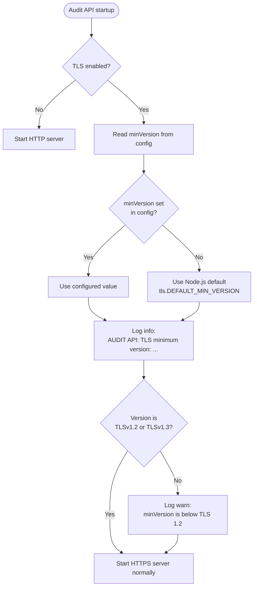
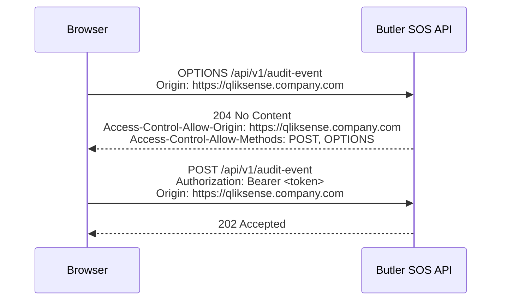
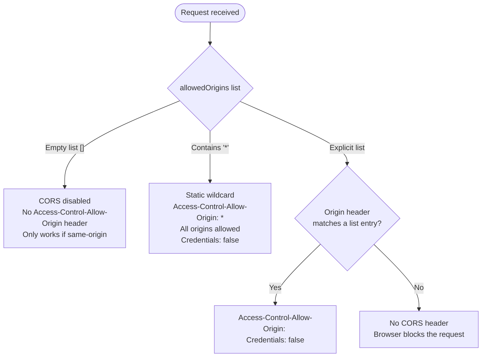
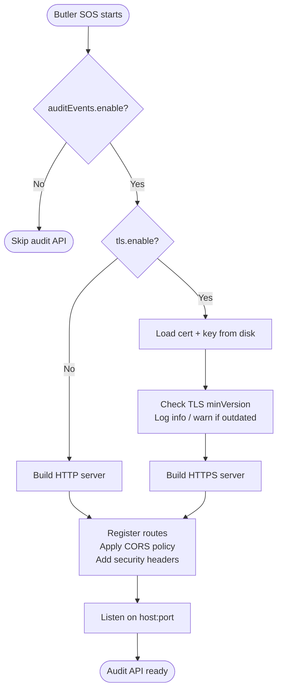

# Audit Events API: TLS and CORS

This document describes how TLS (HTTPS) and CORS (Cross-Origin Resource Sharing) are configured for the Butler SOS audit events API endpoint.

## Why these settings matter

The audit events API is called directly from a **browser-side Qlik Sense extension**. Two browser security policies are therefore relevant:

- **Mixed content**: A page served over HTTPS cannot call an HTTP endpoint. If your Qlik Sense deployment uses HTTPS (it almost certainly does), the audit API must also use HTTPS.
- **Same-origin policy / CORS**: A browser extension makes requests to a different host/port than the Qlik Sense origin. Browsers block these cross-origin requests unless the server explicitly allows them via `Access-Control-Allow-Origin` response headers.

---

## TLS

### When to enable

Enable TLS whenever your Qlik Sense deployment is served over HTTPS — which is the default for all modern Qlik Sense installations.

```
flowchart LR
    browser["Browser (Qlik Sense extension)"]
    sense["Qlik Sense (HTTPS)"]
    api["Butler SOS audit API"]

    browser -- "fetch() POST" --> api
    sense -- "serves extension" --> browser
```

If the API is served over plain HTTP while Qlik Sense is HTTPS, browsers will block the request as **mixed content** and the extension cannot send events.

### Configuration

All TLS settings live under `Butler-SOS.auditEvents.tls`:

```yaml
Butler-SOS:
    auditEvents:
        tls:
            enable: true          # Set to false to use plain HTTP (not recommended with HTTPS Qlik Sense)
            cert: /path/to/server.pem       # PEM-encoded server certificate
            key: /path/to/server-key.pem    # PEM-encoded private key
            # ca: /path/to/root.pem         # Optional: CA certificate for client verification
            # passphrase: <key passphrase>  # Optional: passphrase for encrypted private key
            # minVersion: TLSv1.2           # Optional: minimum TLS version (default: Node.js built-in minimum)
```

| Key | Required | Description |
|-----|----------|-------------|
| `enable` | Yes | `true` enables HTTPS, `false` uses plain HTTP |
| `cert` | When enabled | Path to the PEM server certificate |
| `key` | When enabled | Path to the PEM private key |
| `ca` | No | Path to CA certificate (enables client certificate verification) |
| `passphrase` | No | Passphrase for an encrypted private key |
| `minVersion` | No | Minimum TLS version to accept (e.g. `TLSv1.2`, `TLSv1.3`). Defaults to the Node.js built-in minimum, which is `TLSv1.2` on any modern Node.js release. |

### TLS version check at startup

When TLS is enabled, Butler SOS logs the effective minimum TLS version and warns if it is below TLS 1.2:



Example startup log output (info level):

```
AUDIT API: TLS minimum version: TLSv1.2
AUDIT API: Listening on https://0.0.0.0:9090/api/v1/audit-event
```

If a legacy `minVersion` is configured (e.g. `TLSv1`), an additional warning appears:

```
AUDIT API: TLS minimum version: TLSv1
AUDIT API: TLS minVersion "TLSv1" is below TLS 1.2 — consider upgrading to TLSv1.2 or TLSv1.3.
AUDIT API: Listening on https://0.0.0.0:9090/api/v1/audit-event
```

The server **always starts** regardless of the version check — the warning is advisory only.

### Self-signed certificates

If you use a self-signed certificate, the browser must trust it before the extension can successfully call the API. Import the certificate (or its CA) into the operating system's trust store or the browser's certificate store. There is no way for a browser `fetch()` call to bypass TLS certificate validation.

---

## CORS

### Background

When the audit extension (loaded on a Qlik Sense page at, say, `https://qliksense.company.com`) calls the Butler SOS API at `https://butler-sos.company.com:9090`, the browser treats it as a **cross-origin request**. Before sending the real `POST`, the browser sends an `OPTIONS` preflight request asking the server whether it permits the cross-origin call.



If the preflight is blocked (wrong or missing origin, wrong method), the browser blocks the `POST` and the extension cannot deliver audit events.

### Configuration

CORS is configured via `Butler-SOS.auditEvents.cors.allowedOrigins`:

```yaml
Butler-SOS:
    auditEvents:
        cors:
            allowedOrigins:
                # Add the origin(s) of your Qlik Sense deployment here, for example:
                # - https://qliksense.company.com
                # - https://qlikcloud.com
                # Leaving this list empty disables CORS entirely (safest default if API and Qlik Sense share the same origin).
                # Using '*' allows all origins — not recommended for production use.
```

### The three origin modes



| `allowedOrigins` value | Server response | Use when |
|------------------------|-----------------|----------|
| `[]` (empty) | No CORS headers — browser blocks all cross-origin calls | API and Qlik Sense are on the same origin (rare) |
| `['https://qliksense.company.com']` | Exact-match origin echoed back | Production: recommended — only your Qlik Sense host is allowed |
| `['*']` | `Access-Control-Allow-Origin: *` (static) | Testing or open environments; not recommended for production |

### Security recommendation

Use an explicit allow-list with your actual Qlik Sense origin(s). Avoid `'*'` in production environments — it permits any website to call the API and read unauthenticated responses.

Note: even with `allowedOrigins: ['*']`, `Access-Control-Allow-Credentials` is never set to `true`, so authenticated (cookie/session) requests from third-party origins are not possible. However, the API token in the `Authorization` header would still be visible to any origin that can reach the endpoint.

### Multiple Qlik Sense environments

You can allow several origins simultaneously:

```yaml
cors:
    allowedOrigins:
        - https://qliksense-prod.company.com
        - https://qliksense-dev.company.com
        - https://your-tenant.eu.qlikcloud.com
```

---

## Quick-reference: combined startup flow


