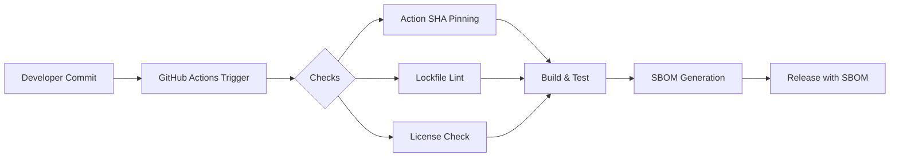
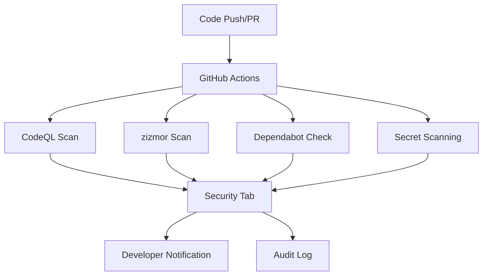
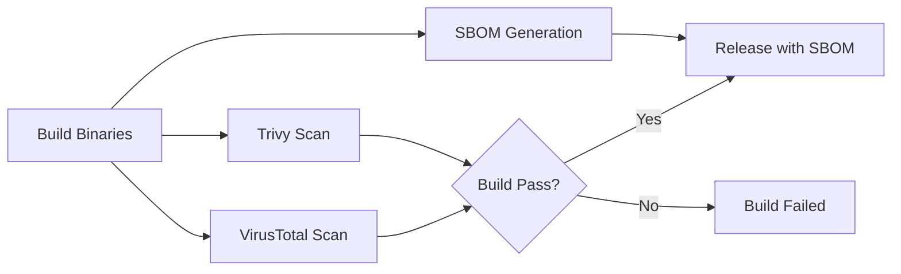
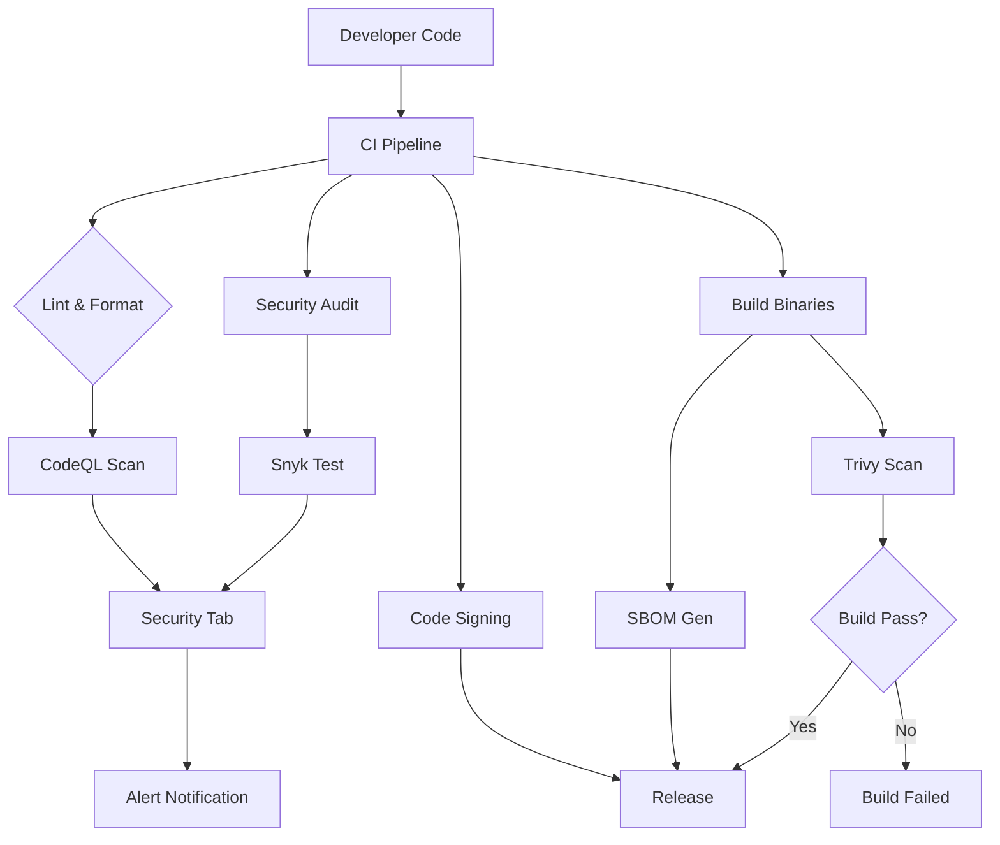
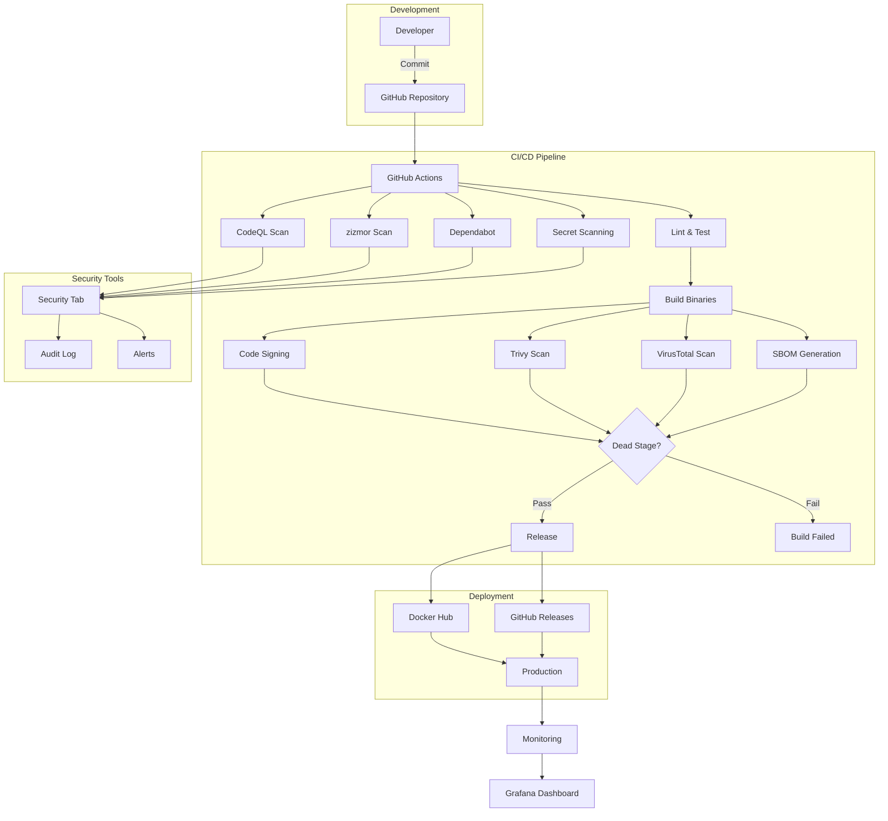

# Butler SOS Security Precautions

## Overview

Butler SOS implements a **security-first approach** throughout its development lifecycle, leveraging GitHub's native security tools, CI/CD pipeline hardening, and defense-in-depth principles. This document outlines the security measures implemented to protect the supply chain, detect vulnerabilities, and ensure secure deployment.

---

## 1. CI/CD Pipeline Security Hardening

### 1.1 GitHub Actions Workflow Hardening

All GitHub Actions workflows in Butler SOS follow these security best practices:

- **Pinned Action Versions**: All actions are pinned to specific commit SHAs (not mutable tags) to prevent supply chain attacks
  - Example: `actions/checkout@de0fac2e4500dabe0009e67214ff5f5447ce83dd` (v6.0.2)
  - Prevents attackers from compromising a tag and affecting all workflows

- **Principle of Least Privilege**: Workflows declare `permissions: {}` at the top level
  - Only required permissions are granted at the job/task level
  - Example: `contents: write` only for release/SBOM tasks

- **Secret Management**: No hardcoded secrets in workflow files
  - All sensitive values use `${{ secrets.XXX }}` syntax
  - Secrets stored in GitHub's encrypted secrets storage

- **Conditional Execution**: Sensitive workflows restrict runs to repository owner
  - Example: `if: github.repository_owner == 'ptarmiganlabs'`
  - Prevents secret exposure in forks

- **Credential Persistence Disabled**: All checkout steps use `persist-credentials: false`
  - Prevents accidental credential leakage in artifacts
  - Addresses the "artipacked" vulnerability class

```yaml
# Example: Hardened workflow header
permissions: {}
jobs:
  build:
    permissions:
      contents: write
    steps:
      - uses: actions/checkout@de0fac2e4500dabe0009e67214ff5f5447ce83dd # v6.0.2
        with:
          persist-credentials: false
```

### 1.2 Supply Chain Security Measures

- **Action Pinning**: All actions pinned to specific SHAs (not mutable tags)
- **SBOM Generation**: Microsoft SBOM tool generates Software Bill of Materials for each release
- **Lockfile Integrity**: `lockfile-lint` validates package-lock.json sources use HTTPS
- **License Enforcement**: Only MIT, Apache-2.0, BSD-3-Clause, and ISC licenses allowed



---

## 2. GitHub Code Security Tools

### 2.1 Dependabot

- **Configuration**: `.github/dependabot.yml`
- **Schedule**: Weekly scans for npm ecosystem
- **Cooldown**: 7-day delay before creating PRs for new versions
  - Reduces risk of pulling in compromised fresh releases
  - Allows time for community vetting

```yaml
version: 2
updates:
  - package-ecosystem: "npm"
    directory: "/"
    schedule:
      interval: "weekly"
    cooldown:
      default-days: 7
```

### 2.2 CodeQL Analysis

- **Workflow**: `.github/workflows/codeql-analysis.yaml`
- **Language**: JavaScript
- **Triggers**: Push/PR to `master`, weekly scheduled scans (Saturdays 22:00 UTC)
- **Integration**: Uploads SARIF results to GitHub Security tab
- **Permissions**: `actions: read, contents: read, security-events: write`

### 2.3 Secret Scanning

- **Default Scanning**: GitHub's native secret detection for public repositories
- **Coverage**: Scans for known secret patterns (API keys, tokens, credentials)
- **Custom Rules**: No custom patterns configured (uses GitHub defaults)

### 2.4 zizmor (Workflow Security)

- **Workflow**: `.github/workflows/zizmor.yaml`
- **Purpose**: Scans GitHub Actions workflows for security issues
- **Detects**: Dangerous triggers, excessive permissions, template injection, artipacked credentials
- **Integration**: Uploads SARIF to GitHub Security tab
- **Permissions**: `security-events: write, contents: read, actions: read`



---

## 3. Vulnerability Scanning

### 3.1 Snyk (Code Scanning)

- **Workflow**: Integrated in `.github/workflows/insiders-build.yaml`
- **Scope**: Runs on ubuntu-latest insider builds
- **Output**: SARIF upload to GitHub Security tab
- **Configuration**: Scans `package.json` dependencies
- **Threshold**: High severity and above

### 3.2 Trivy (Docker Image Scanning)

- **Workflow**: `.github/workflows/docker-image-build.yaml`
- **Purpose**: Scans built Docker images for vulnerabilities
- **Severity**: Fails build on CRITICAL/HIGH vulnerabilities
- **Scope**: OS packages and library packages
- **Policy**: Ignores unfixed vulnerabilities

```yaml
- name: Run Trivy vulnerability scanner
  uses: aquasecurity/trivy-action@18f2510a576aa4b7b8feae8349970a12d3b3b05 # v0.36.0
  with:
    image-ref: '${{ env.REGISTRY }}/${{ env.IMAGE_NAME}}:${{ steps.meta.outputs.tags }}'
    format: 'sarif'
    output: 'trivy-results.sarif'
    severity: 'CRITICAL,HIGH'
    ignore-unfixed: true
```

### 3.3 VirusTotal Scanning

- **Workflow**: `.github/workflows/virus-scan.yaml`
- **Purpose**: Scans release artifacts for malware
- **Integration**: Uploads scan results to GitHub Releases
- **Permissions**: `contents: write` at job level

### 3.4 SBOM Generation

- **Workflow**: Integrated in `.github/workflows/ci.yaml` (sbom-build job)
- **Tool**: Microsoft SBOM Tool
- **Output**: SPDX JSON format
- **Upload**: Attached to GitHub Releases + workflow artifact backup
- **Metadata**: Includes package name, version, publisher info



---

## 4. Application Security

### 4.1 Code Signing

Butler SOS binaries are code-signed to ensure integrity and authenticity:

**macOS Builds**:
- Certificate-based signing with Apple Developer ID
- Notarization with Apple's Notary Service
- Keychain isolation for CI environments
- Debug output commented out (`if: false`) to prevent template injection

**Windows Builds**:
- Thumbprint-based signing using Certum certificates
- Dual-pass signing (SHA1 + SHA256)
- Uses Windows SDK `signtool.exe`

```yaml
# macOS signing environment
env:
  MACOS_CERTIFICATE: ${{ secrets.PROD_MACOS_CERTIFICATE_BASE64_CODESIGN }}
  MACOS_CERTIFICATE_PWD: ${{ secrets.PROD_MACOS_CERTIFICATE_CODESIGN_PWD }}
  MACOS_CERTIFICATE_NAME: ${{ secrets.PROD_MACOS_CERTIFICATE_CODESIGN_NAME }}
```

### 4.2 Docker Security

**Dockerfile Hardening**:
- Multi-stage build (separates build and runtime)
- Non-root user execution (`node` user)
- Minimal base image (`node:24-bookworm-slim`)
- Production environment (`NODE_ENV=production`)
- Healthcheck instruction for container monitoring

```dockerfile
# Multi-stage build example
FROM node:24-bookworm-slim AS builder
# ... build steps ...

FROM node:24-bookworm-slim
USER node
WORKDIR /app
COPY --from=builder /app/node_modules ./node_modules
HEALTHCHECK --interval=30s --timeout=10s \
  CMD node docker-healthcheck.js || exit 1
```

**Docker Image Scanning**:
- Trivy scans for OS and library vulnerabilities
- Fails build on CRITICAL/HIGH issues
- Integrated into CI pipeline

### 4.3 Fastify Security Plugins

Butler SOS uses Fastify web framework with security-focused plugins:

| Plugin | Purpose | Configuration |
|--------|---------|---------------|
| `@fastify/rate-limit` | Rate limiting for API endpoints | Prevents abuse and DoS |
| `@fastify/cors` | CORS policy management | Configurable origin allowlist |
| `@fastify/sensible` | Security best practices | Helmet-like defaults |

### 4.4 System Information Security

- **Documentation**: `docs/system-information-security.md`
- **Configuration**: `Butler-SOS.systemInfo.enable: false`
- **Purpose**: Disables OS command execution in security-sensitive environments
- **Risk Mitigation**: Prevents command injection via `systeminformation` npm package

---

## 5. Security Scripts and Controls

### 5.1 npm Scripts

Butler SOS includes several security-focused npm scripts:

| Script | Command | Purpose |
|--------|---------|---------|
| `npm run security:audit` | `npm audit --audit-level=high` | Run npm audit for high+ severity issues |
| `npm run security:full` | `npm run security:audit && snyk test --severity-threshold=high` | Full security scan with Snyk |
| `npm run deps:lockfile` | `lockfile-lint --path package-lock.json --validate-https --validate-integrity` | Validate lockfile security |
| `npm run deps:audit` | `audit-ci --config .audit-ci.json` | CI-compatible npm audit wrapper |
| `npm run license:check` | `license-checker-rseidelsohn --onlyAllow 'MIT;Apache-2.0;...'` | Enforce permissive license policy |
| `npm run sbom:generate` | Uses Microsoft SBOM tool | Generate Software Bill of Materials |

### 5.2 CI Pipeline Controls

**Debug Step Management**:
- All debug output steps commented out with `if: false`
- Prevents Zizmor "template-injection" alerts
- Preserves steps for troubleshooting (can be re-enabled temporarily)

**Template Injection Prevention**:
- Moved `${{ runner.name }}` and `${{ github.sha }}` from `run:` blocks to `env:` blocks
- Uses environment variables (`$env:RUNNER_NAME`, `$env:GITHUB_SHA`) in scripts
- Eliminates code injection vectors in PowerShell/bash scripts

**Credential Persistence**:
- All `actions/checkout` steps use `persist-credentials: false`
- Prevents "artipacked" vulnerability (credentials in artifacts)
- Addresses GitHub Advisory GHSA-3j7h-6hqj-gr63



---

## 6. Documentation and Compliance

### 6.1 Existing Documentation

**System Information Security**:
- File: `docs/system-information-security.md`
- Covers: OS command execution risks, configuration options, best practices
- Version history of security-related changes

**Docker Compose Examples**:
- Location: `docs/docker-compose/`
- Includes: Full-stack setups (Butler SOS + InfluxDB + Grafana)
- Purpose: Reference architectures for secure deployment

### 6.2 Security Gaps Identified

| Gap | Status | Recommendation |
|-----|--------|-----------------|
| Missing `SECURITY.md` | TODO | Create vulnerability reporting policy |
| Inactive OSV Scanner | File extension issue (`.yml` vs `._yml`) | Rename to `.yml` |
| Missing `.audit-ci.json` | Referenced but not present | Create configuration file |
| Example `.env` with hardcoded secrets | `docs/docker-compose/.env` | Use placeholders instead |

### 6.3 Compliance and Best Practices

- **Supply Chain**: SBOM generation, lockfile integrity, license enforcement
- **Vulnerability Management**: Multi-tool scanning (CodeQL, Snyk, Trivy, VirusTotal)
- **Principle of Least Privilege**: Minimal workflow permissions, non-root containers
- **Defense in Depth**: Multiple scanning layers, code signing, rate limiting

---

## Appendix: Complete Security Architecture



---

## Summary

Butler SOS implements a comprehensive security strategy covering:

1. **Supply Chain Security**: Action pinning, SBOM, lockfile integrity
2. **Vulnerability Detection**: CodeQL, Snyk, Trivy, VirusTotal, Secret Scanning
3. **Application Security**: Code signing, Docker hardening, Fastify plugins
4. **CI/CD Hardening**: Least privilege, no hardcoded secrets, credential hygiene
5. **Compliance**: License enforcement, documentation, multi-layer scanning

This multi-layered approach ensures Butler SOS maintains a strong security posture throughout its development and deployment lifecycle.
