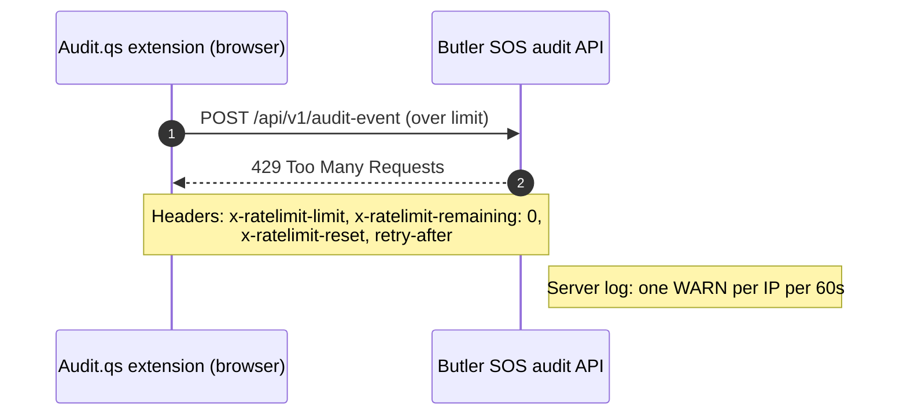
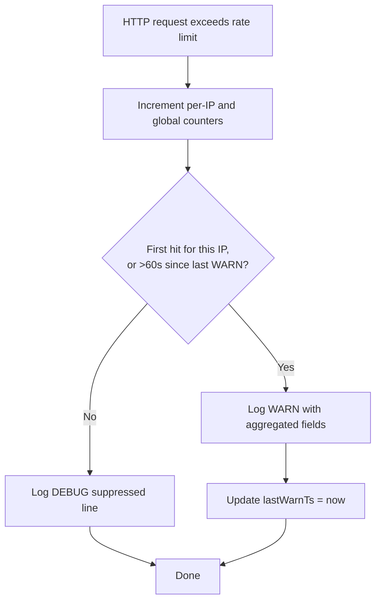
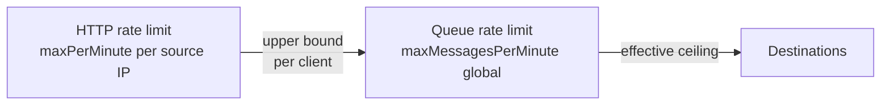
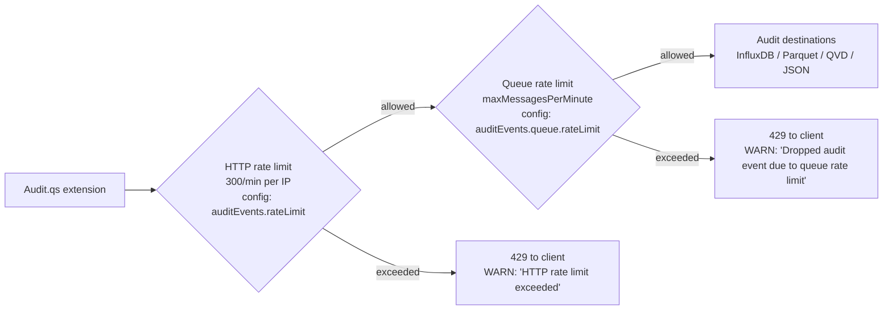

# Audit Events API: HTTP Rate Limiting

The audit events API is a small HTTP endpoint (`POST /api/v1/audit-event`) that the
Audit.qs browser extension calls from every Qlik Sense user's session. To protect the
Butler SOS process from a runaway or misbehaving client, the API applies a per-source-IP
HTTP rate limit.

This page describes:

- how the rate limit is configured
- what an over-the-limit client sees
- what the Butler SOS server logs when the limit kicks in
- how to tell a rate-limit rejection apart from other client-side connectivity issues

---

## Configuration

All HTTP rate-limit settings live under `Butler-SOS.auditEvents.rateLimit`:

```yaml
Butler-SOS:
    auditEvents:
        rateLimit:
            enable: true       # Default true. Set to false to disable HTTP rate limiting.
            maxPerMinute: 300  # Default 300. Maximum requests per minute per source IP.
```

| Key | Default | Description |
|-----|---------|-------------|
| `enable` | `true` | When `false`, the HTTP rate limit is not registered. Every well-formed request is processed. |
| `maxPerMinute` | `300` | Maximum number of `POST /api/v1/audit-event` requests accepted from a single source IP per rolling 60-second window. |

The rate-limit **key** is the source IP address of the client (`req.ip`). The key is not
configurable: every client from the same IP shares one bucket.

> **Note:** This HTTP rate limit is **separate from the audit-event queue rate limit**
> (`Butler-SOS.auditEvents.queue.rateLimit.*`). The two layers are independent and have
> different goals. See [Sizing the two rate limits](#sizing-the-two-rate-limits) below
> for how to pick values, and [How the two rate limits fit together](#how-the-two-rate-limits-fit-together)
> at the end of this page for the architectural view.

---

## What the client sees

When a client exceeds the limit, Butler SOS responds with `429 Too Many Requests` and a
small JSON body that follows the same shape the rest of the audit API uses:

```json
{
    "status": "error",
    "receivedAt": "2026-01-01T00:00:00.000Z",
    "outcome": "dropped",
    "reason": "Rate limit exceeded"
}
```

The response also carries four standard rate-limit headers that the client can use to
back off intelligently:

| Header | Meaning |
|--------|---------|
| `x-ratelimit-limit` | The configured maximum (e.g. `300`) |
| `x-ratelimit-remaining` | `0` once the limit is hit |
| `x-ratelimit-reset` | Seconds until the window resets |
| `retry-after` | Seconds the client should wait before retrying |



---

## What the server logs

### Previous behaviour (for context)

Earlier versions of Butler SOS logged **an `error` line with a full JavaScript stack
trace for every rate-limited request**. That produced a lot of log noise under load
without giving operators any extra information beyond "this IP got blocked".

### New behaviour

- **No error log** is written for rate-limited requests. The 429 response is signalled
  to the client as described above; the server's own log does not treat it as an error.
- **One aggregated `warn`** is written per source IP per 60-second window. The WARN
  includes running counters so an operator can see how bad the abuse is.
- **Additional hits inside the same 60-second window** are written at **`debug` level
  only**, so the log stays readable even under sustained abuse.

### Example: a stress test from one IP

With the default `maxPerMinute: 300` and one source IP firing 500 requests in 5 seconds:

```
warn: AUDIT API: HTTP rate limit exceeded ip=192.168.3.250 url=/api/v1/audit-event key=192.168.3.250 max=300/1m ipViolations=1 ipFirstViolationAgo=0s globalViolations=1 windowSeconds=60
debug: AUDIT API: HTTP rate limit exceeded (suppressed) ip=192.168.3.250 ipViolations=2 globalViolations=2
debug: AUDIT API: HTTP rate limit exceeded (suppressed) ip=192.168.3.250 ipViolations=3 globalViolations=3
debug: AUDIT API: HTTP rate limit exceeded (suppressed) ip=192.168.3.250 ipViolations=4 globalViolations=4
... (60 seconds pass) ...
warn: AUDIT API: HTTP rate limit exceeded ip=192.168.3.250 ... ipViolations=N ... globalViolations=M windowSeconds=60
```

### Field glossary

| Field | Meaning |
|-------|---------|
| `ip` | Source IP of the rejected request |
| `key` | Rate-limit key (currently the same as `ip`) |
| `url` | Request URL (always `/api/v1/audit-event` in this release) |
| `max=N/1m` | The configured maximum per minute |
| `ipViolations=N` | How many times this IP has been rate-limited so far (counting only rejections, not allowed requests) |
| `ipFirstViolationAgo=Xs` | Seconds since this IP's first rate-limit hit since it was first observed (state is purged after 15 minutes of inactivity) |
| `globalViolations=N` | How many rate-limit rejections Butler SOS has served in total since startup |
| `windowSeconds=60` | The throttle window length for the WARN itself |
| `(suppressed)` (debug lines) | Indicates a hit inside the 60-second WARN window for an IP that was already warned about |

### Throttle decision flowchart



### Counter scope and lifetime

- Counters live **in process memory only**. They are cleared when Butler SOS restarts.
- Counters are **not exported to InfluxDB** or any other destination.
- Per-IP state entries are purged automatically **15 minutes after the last seen
  activity** for that IP, so a long-running abusive client does not bloat memory
  indefinitely. The 15-minute TTL is a fixed internal value, not configurable.

---

## Sizing the two rate limits

The HTTP rate limit (this page) and the **queue rate limit** (`auditEvents.queue.rateLimit.*`,
documented in the audit queue section) are layered, and their relationship matters. Because
the HTTP rate limit runs first, anything the queue rate limit does is bounded by what the
HTTP layer accepted.

| HTTP limit | Queue limit | Effective behaviour |
|------------|-------------|---------------------|
| 300/min | **300/min** | The two layers are matched. The queue limit is meaningful as a downstream safety net (e.g. if a temporary processing slowdown means events queue up, the queue limit can shed load before destinations are overwhelmed). |
| 300/min | **600/min** | The queue limit is **dead weight** in a single-client deployment. In a multi-client deployment it can still be reached if many clients all hit their per-IP limit, but a per-IP ceiling higher than the global ceiling is usually a sign the two numbers were set independently. |
| 300/min | **100/min** | The queue limit becomes the effective ceiling. Useful if your downstream destination (InfluxDB, Parquet writer, etc.) cannot keep up with the HTTP-accepted rate. |

**General rule:** keep `auditEvents.queue.rateLimit.maxMessagesPerMinute <= auditEvents.rateLimit.maxPerMinute`, and prefer keeping them equal unless you have a specific reason to make the queue limit tighter. If you find yourself wanting the queue limit higher than the HTTP limit, raise the HTTP limit instead.



The arrow shows that `Q` cannot exceed what one client could push past `H`. If `Q > H`,
the queue limit is suspicious in a single-client deployment. If `Q < H`, `Q` is the
effective ceiling.

### What each limit actually protects

- **HTTP rate limit** — protects the Butler SOS process itself (Fastify request handling,
  JSON parsing, queue insertion). Raise this if the audit API is rejecting legitimate events.
- **Queue rate limit** — protects the **destination systems** (InfluxDB writes, Parquet
  flushes, QVD/JSON file IO). Raise this if destinations can sustain a higher write rate
  than the queue currently allows.

### Picking a starting number

A reasonable starting point for most installations is to set both limits to the same value
(for example 300–600/min), then watch the Butler SOS logs and the destination's own metrics:

- See `HTTP rate limit exceeded` warnings → raise the HTTP limit.
- See `Dropped audit event due to queue rate limit` warnings → either raise the queue
  limit (if destinations can keep up) or slow the upstream client.

### Startup consistency warning

Butler SOS logs a `warn` at startup when the two settings look inconsistent:

- If the queue limit is **higher** than the HTTP limit, the queue limit is unreachable in
  a single-client deployment. Butler SOS suggests raising the HTTP limit or lowering the
  queue limit.
- If the queue limit is **less than half** the HTTP limit, the queue limit will be the
  effective ceiling for any single client. Butler SOS asks you to confirm that is
  intentional.

This is a one-shot warning at startup; the runtime WARN/DEBUG stream for actual rate-limit
hits is unchanged. If the audit API is disabled, or either rate limit is disabled, no
comparison is made and no warning is logged.

---

## Tuning and troubleshooting

### When to raise `maxPerMinute`

Raise the limit when a single legitimate client (e.g. a heavily-used Qlik Sense hub) needs
more than 300 events per minute. A signal that you need to raise it is sustained
`ipViolations` rising for **one** source IP while `globalViolations` stays roughly equal
to `ipViolations` — meaning the problem is concentrated, not spread.

### When to lower it

Lower the limit if you see repeated `globalViolations` climbing much faster than any
single `ipViolations`. That pattern means many different IPs are hitting the limit, which
suggests an extension bug, a misconfigured retry loop, or an unauthorized client trying
to flood the endpoint.

### Telling rate-limit rejections apart from other connectivity issues

If the client is seeing 429 responses but **no** Butler SOS log lines contain
`HTTP rate limit exceeded`, the request never reached the server. Common reasons:

- TLS handshake failed (mixed-content, certificate not trusted). See the TLS configuration page.
- CORS preflight was rejected (the Qlik Sense origin is not in
  `Butler-SOS.auditEvents.cors.allowedOrigins`). See the CORS configuration page.
- The bearer token check failed (no `Authorization: Bearer <token>` header, or wrong
  token) — that produces a 401, not a 429.
- Network or firewall dropped the request before it reached Butler SOS.

### How the two rate limits fit together

The audit pipeline has **two independent rate limits**. They protect different things and
log in different places.



| Layer | Config key | Purpose | Rejection signal to client | Server log entry |
|-------|-----------|---------|----------------------------|------------------|
| HTTP rate limit | `Butler-SOS.auditEvents.rateLimit.*` | Protect Butler SOS from runaway clients, buggy extensions, or unauthorized flooding | `429 Too Many Requests` with `outcome: "dropped"`, `reason: "Rate limit exceeded"` | `warn: AUDIT API: HTTP rate limit exceeded ...` (this page) |
| Queue rate limit | `Butler-SOS.auditEvents.queue.rateLimit.*` | Throttle how fast Butler SOS writes to downstream destinations (InfluxDB, Parquet, QVD, JSON) | `202 Accepted` — the event is accepted but dropped before being written | `warn: AUDIT API: Dropped audit event due to queue rate limit ...` |

If you see queue-level drops in the log, raise
`Butler-SOS.auditEvents.queue.rateLimit.maxMessagesPerMinute`. If you see HTTP-level
rejections, raise `Butler-SOS.auditEvents.rateLimit.maxPerMinute` (or fix the client).

---

## Related settings

- `Butler-SOS.auditEvents.tls` — TLS (HTTPS) configuration for the same endpoint.
  See the audit API TLS configuration page.
- `Butler-SOS.auditEvents.cors.allowedOrigins` — browser CORS configuration.
- `Butler-SOS.auditEvents.queue.rateLimit` — the second, queue-level rate limit
  described above.
