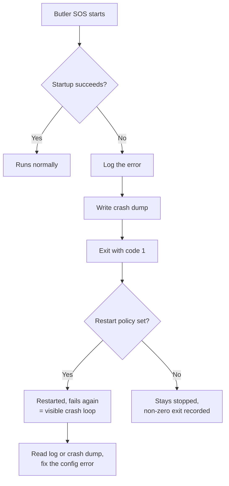

# Startup Failures Now Report Themselves

Butler SOS now **exits with a failure code** when it cannot start, and writes a crash dump
describing why. Previously it reported success and quietly stopped.

If you run Butler SOS under Docker or systemd with an automatic restart policy, this is the
change most likely to be noticeable after upgrading — and it may look at first like something
has broken. It has not. This page explains what changed, why, and what to do if you see new
behaviour after the upgrade.

---

## What was wrong before

When a program finishes, it hands the operating system a number saying how it went. Zero means
"finished normally"; anything else means "something went wrong". Restart policies rely on this
number to decide whether to intervene.

If Butler SOS hit an unrecoverable problem while starting — an unreadable certificate file, a
port already in use, an InfluxDB it could not reach at startup, a config file it could not make
sense of — it stopped, but reported **zero**. A clean exit. Nothing to see here.

The consequence:

- **Docker `restart: on-failure` never restarted it.** Docker saw a container that had completed
  its work and exited successfully, so it left it stopped.
- **systemd `Restart=on-failure` never restarted it.** Same reasoning.
- **Monitoring that watched for a non-zero exit saw nothing.**

So a Butler SOS that failed to start sat dead and silent. The restart policy you had put in
place specifically for this situation did not fire, because as far as the system was concerned
there was no failure. The only sign was the absence of data arriving — which, depending on what
else you monitor, could go unnoticed for a long time.

---

## What happens now

When Butler SOS cannot start, it:

1. **Exits with code 1**, so restart policies and monitoring see a genuine failure.
2. **Writes a crash dump** to disk recording what went wrong (unless you have disabled crash
   dumps — see below).
3. **Logs the error**, as before.

Restart policies now behave the way you configured them to.

---

## The practical consequence: you may see a restart loop

This is the part worth reading carefully.

If Butler SOS fails to start because of something that will not fix itself — a typo in the
config file, a certificate path that does not exist, a port permanently occupied by another
service — then under an automatic restart policy it will now fail, restart, fail again, and keep
going. A **crash loop**.

**This is intended behaviour, not a regression.** A service that visibly cannot start is far
easier to notice and diagnose than one that is silently absent. The loop is the symptom
surfacing, not the disease.

If you see Butler SOS restarting repeatedly after upgrading:

- **Do not assume the restart policy is misconfigured.** It is working; it is telling you
  something.
- **Read the log, or the crash dump**, and find the underlying error. It will almost always be a
  configuration problem that was already present before the upgrade — it just was not visible.
- **Fix that, and the loop stops.** Butler SOS was never going to start successfully in this
  state; previously it just failed quietly.



### If you would rather it did not loop

Docker's `restart: on-failure` accepts a maximum retry count, and systemd offers
`StartLimitBurst` and `StartLimitIntervalSec` for the same purpose. Either will stop a
persistent failure from restarting indefinitely while still letting a transient one recover.
That is a sensible thing to configure regardless of this change.

---

## Where the crash dump goes

Crash dumps are controlled by the `Butler-SOS.crashFile` section of the config file:

```yaml
Butler-SOS:
    crashFile:
        enable: true # Should crash dump files be created? Default: true
        crashFileDirectory: ./crash_dumps # Directory where crash files are stored.
                                          # Relative to working directory; absolute paths also supported.
                                          # Use empty string to write to the working directory.
        crashFileCreateJson: true # Should a JSON crash dump file be created? Default: true
        crashFileCreateText: true # Should a plain-text crash dump file be created? Default: true
```

| Key | Default | Description |
|-----|---------|-------------|
| `enable` | `true` | When `false`, no crash dump is written. The exit code is still 1 and the error is still logged. |
| `crashFileDirectory` | `./crash_dumps` | Where dumps are written. Relative paths are resolved against the working directory; absolute paths work too. An empty string means the working directory itself. |
| `crashFileCreateJson` | `true` | Write a machine-readable JSON dump. |
| `crashFileCreateText` | `true` | Write a human-readable plain-text dump. |

Files are named `crash_dump_<timestamp>_<counter>.json` and `.txt`, so successive crashes do not
overwrite each other. **A crash loop will therefore accumulate files** — another reason to cap
restart attempts, and to check the directory after resolving a startup problem.

If the crash dump cannot be written — a directory that does not exist, or one the Butler SOS
user cannot write to — Butler SOS does not treat that as a further error. It still exits with
code 1 and the error is still in the log. This matters in Docker in particular, where the
container runs as a non-root user that may not be able to write to the working directory. If you
want crash dumps from a container, point `crashFileDirectory` at a mounted volume the container
user can write to.

### Crash dumps are potentially sensitive

Treat crash dump files with the same care as log files, and do not attach them to public issue
reports without reading them first.

Butler SOS deliberately excludes your configuration secrets — passwords, tokens, certificates —
from the dump, and applies best-effort redaction of common credential patterns to the error
message and stack trace. But the error text itself comes from whatever component failed, and
error messages from HTTP clients and database drivers can carry things such as host names,
connection strings, or fragments of a request. Redaction catches the common shapes; it cannot
guarantee it catches everything.

---

## What has not changed

- **Errors after a successful start.** This change is about *startup* failures. Once Butler SOS
  is up and running, a problem with a single destination — InfluxDB briefly unreachable, an MQTT
  broker restarting — is logged and Butler SOS keeps running, exactly as before. A monitoring
  tool that stops at the first hiccup would be worse than useless.
- **Normal shutdown.** Stopping Butler SOS deliberately still exits with code 0.
- **Log output.** Startup errors were logged before and are logged now. What changed is the exit
  code and the crash dump, not the logging.

---

## Related settings

- `Butler-SOS.crashFile.*` — crash dump behaviour, described above.
- `Butler-SOS.logLevel` — set to `verbose` or `debug` for more detail while diagnosing a startup
  failure. See the logging configuration page.
